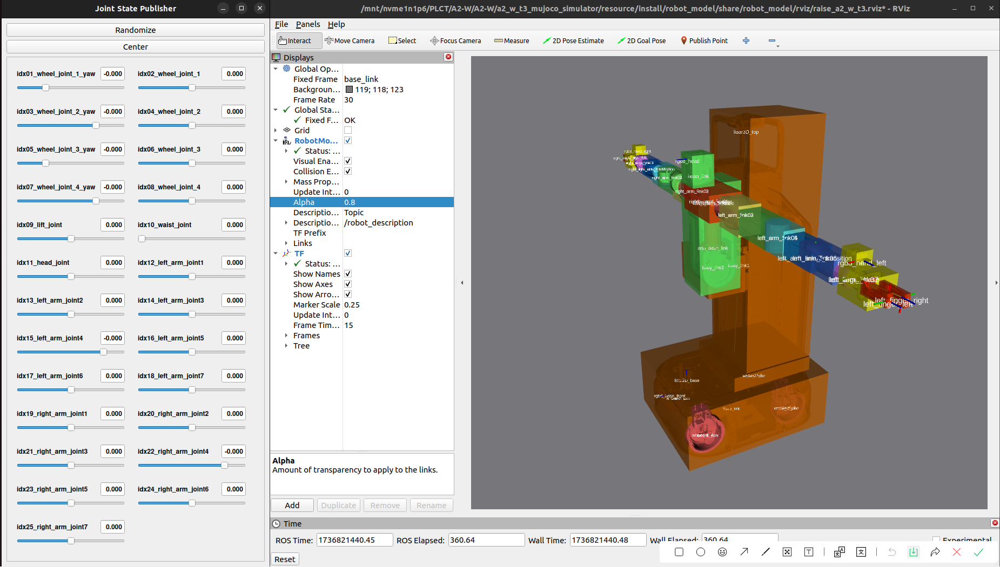
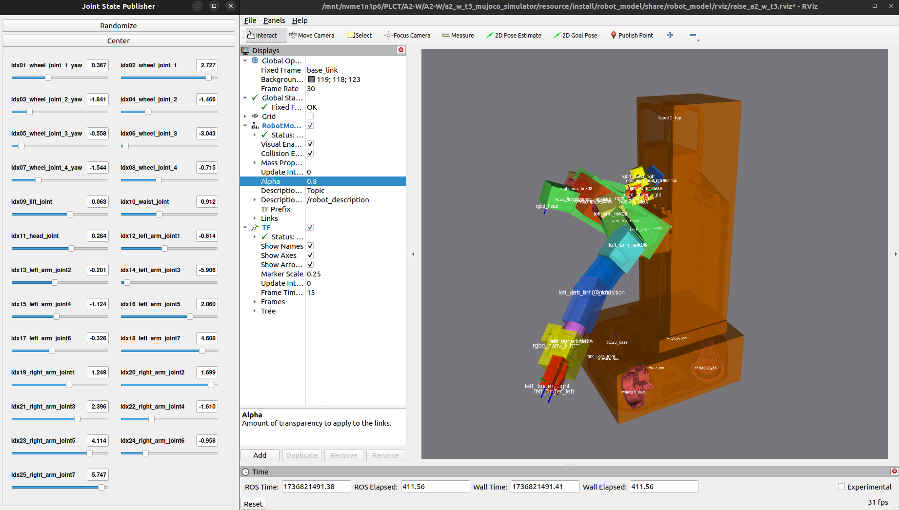
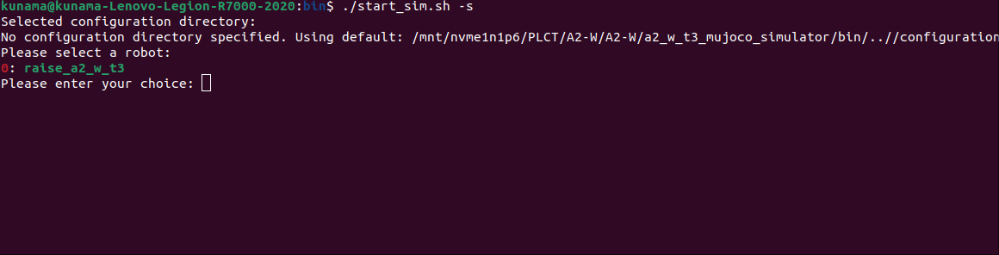
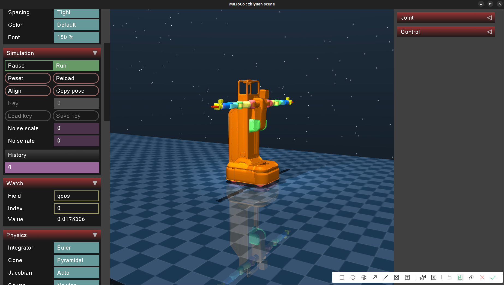

# A2-W Simulation Record

## publish robot model to rviz

1.  build the package with colcon in folder `resource` :

   ```bash
   cd <path to a2_w_t3_mujoco_simulator/resource>
   colcon build --symlink-install
   ```

2. launch ros2 package `robot_model` to publish robot model

   ```bash
   ros2 launch robot_model raise_a2_w_t3.launch.py debug_urdf:=true
   ```

   

3. able to modify robot state with Joint State publisher gui

   


## publish robot model to mujoco

1. install gcc-12 and g++-13

   ```bash
   sudo apt-get update
   sudo apt-get install gcc-13 g++-13
   ```

2. launch bash script under folder `bin`

   ```bash
   cd <path to a2_w_t3_mujoco_simulator/bin>
   ./start_sim.sh -s
   ```

   

   choose `raise_a2_w_t3 `

   

