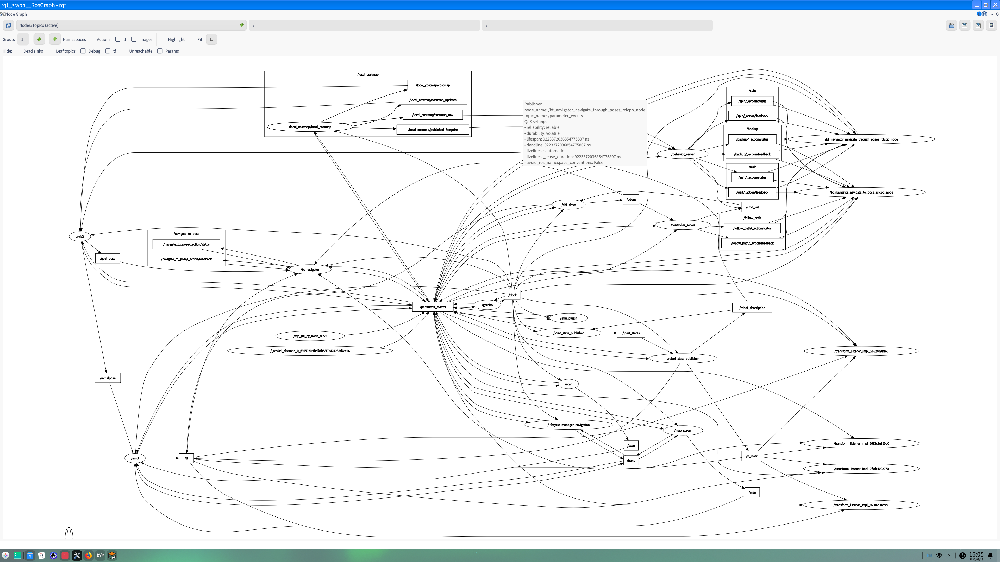

## 环境配置

OS ： OpenEuler 24.03(LTS) 

CPU ： Intel(R) Core(TM) i5-7260U 

内存： 8G


### Gazebo 源配置：

添加 `gazebo` 源 `vim /etc/yum.repos.d/gazebo.repo`：

```bash
[openEulerROS-humble-3rdparty]
name=openEulerROS-humble
baseurl=https://eulermaker.compass-ci.openeuler.openatom.cn/api/ems1/repositories/ROS-SIG-Multi-Version_ros-humble_openEuler-24.03-LTS-ROS-3rdparty/openEuler%3A24.03-LTS/x86_64 
enabled=1
gpgcheck=0
```


### 启动 gazebo

Terminal 中输入指令： `gazebo` ， 报错：

```bash
gazebo: error while loading shared libraries: libhdf5.so.310: cannot open shared object file: No such file or directory
```

参考：https://github.com/IfReturn/PLCT/blob/main/gazebo_in_OpenEuler2403.md 增加`custom.conf`  再次启动 `gazebo` 成功启动图形界面：


但发现图形界面显示不完全，日志中显示：

```bash
[openeuler@localhost Desktop]$ gazebo --verbose
Gazebo multi-robot simulator, version 11.14.0
Copyright (C) 2012 Open Source Robotics Foundation.
Released under the Apache 2 License.
http://gazebosim.org

[Msg] Waiting for master.
[Msg] Connected to gazebo master @ http://127.0.0.1:11345
[Msg] Publicized address: 10.213.20.27
Gazebo multi-robot simulator, version 11.14.0
Copyright (C) 2012 Open Source Robotics Foundation.
Released under the Apache 2 License.
http://gazebosim.org

[Msg] Waiting for master.
[Msg] Connected to gazebo master @ http://127.0.0.1:11345
[Msg] Publicized address: 10.213.20.27
[Msg] Loading world file [/usr/share/gazebo-11/worlds/empty.world]
AL lib: (WW) GetSymbol: Failed to load jack_error_callback: /usr/lib64/libjack.so.0: undefined symbol: jack_error_callback
AL lib: (WW) jack_msg_handler: Cannot connect to server socket err = No such file or directory
AL lib: (WW) jack_msg_handler: Cannot connect to server request channel
AL lib: (WW) jack_msg_handler: jack server is not running or cannot be started
AL lib: (WW) jack_msg_handler: JackShmReadWritePtr::~JackShmReadWritePtr - Init not done for -1, skipping unlock
AL lib: (WW) jack_msg_handler: JackShmReadWritePtr::~JackShmReadWritePtr - Init not done for -1, skipping unlock
AL lib: (WW) ALCjackBackendFactory_init: jack_client_open() failed, 0x11
AL lib: (WW) alc_initconfig: Failed to initialize backend "jack"
[Err] [Scene.cc:227] Service call[/shadow_caster_material_name] timed out
[Err] [Scene.cc:249] Service call[/shadow_caster_render_back_faces] timed out
[Wrn] [Scene.cc:463] Ignition transport [/scene_info] service call failed, falling back to gazebo transport [scene_info] request.
[Wrn] [MainWindow.cc:373] Ignition transport [/scene_info] service call failed, falling back to gazebo transport [scene_info] request.
[Err] [Visual.cc:385] Service name [/shininess] not advertised, not attempting to load shininess for visual with name [ground_plane::link::visual].
```

但并无 `zink_dri.so ` 相关报错提示。


### 测试 nav2_sim

下载 `nav2_sim` 的源码 `src` ，通过 `colcon` 进行编译，执行：

**建图测试**

```bash
ros2 launch robot_slam slam_mapping.launch
```


可以实现基本建图功能，能够保存地图文件

**导航测试**

```bash
ros2 launch robot_navigation navigation_launch.py
```


+ rqt_grah : 



+ node list


无法启动 `/global_map ` 相关节点，无法发布相关话题，暂时未能正常实现导航功能

> Unbuntu下运行：
>
> ```bash
> ros2 launch robot_navigation navigation_launch.py
> ```
>
> + rqt_grah : 
>
> 
>
> + node list
>
> 