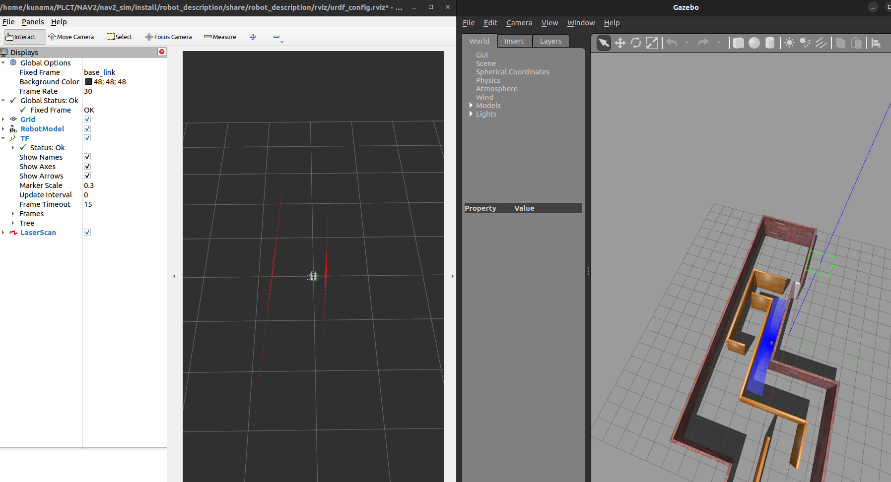
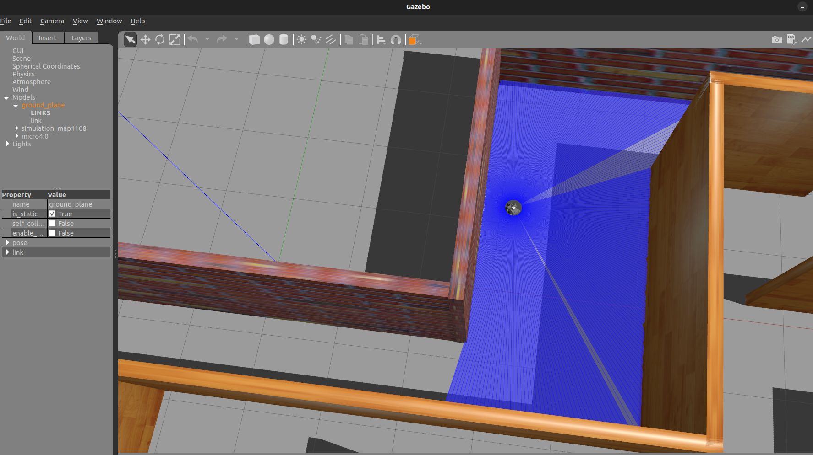
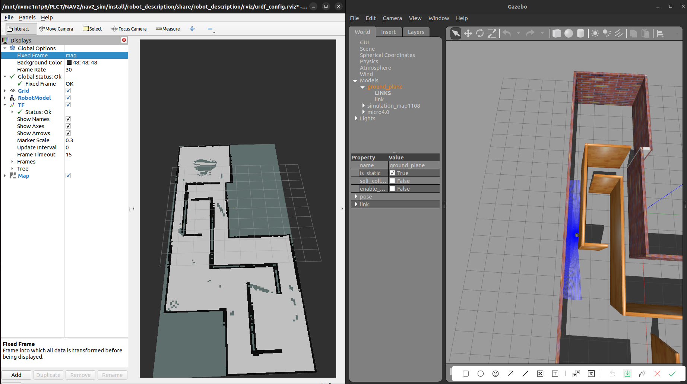
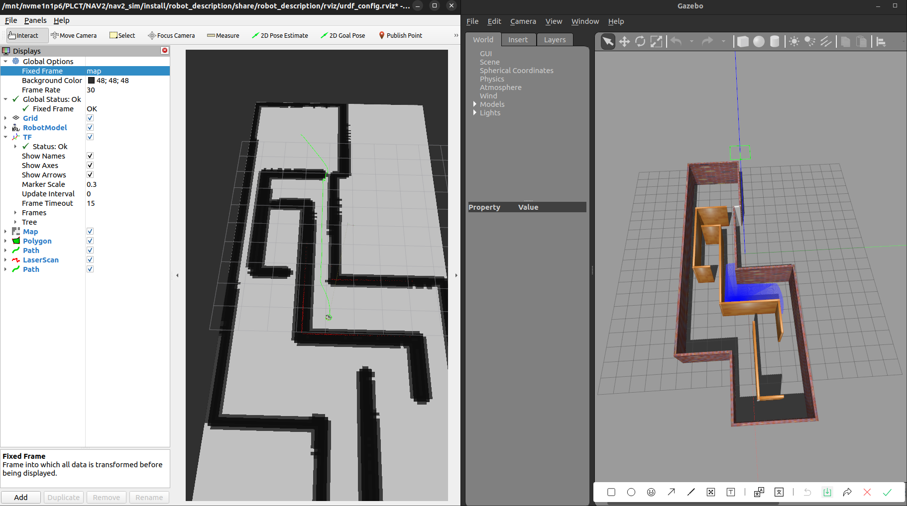

# Yahboom RISC-V ROS Robotcar Mapping & Navigation Simulation

Description : A simulation packgage based on Gazebo and Navigation2 for Yahboom RISC-V ROS Robotcar

System : Ubuntu 22.04

## robot discription

Desicription : to display robot and the simulation environment

`ros2 launch robot_description robot_display_launch.py`

+ display robot and environment
+ able to drive the robot with teleop_twist_keyboard
+ able to scan the environment with radar

## robot slam

`ros2 launch robot_slam slam_mapping_launch.py`

 + able to mapping with slam_toolbox

`ros2 launch robot_slam map_saving_launch.py`
 + able to save map to specified path

`ros2 launch robot_slam acml_launch.py`
 + able to load saved map 

## robot navigation

`ros2 launch robot_navigation navigation_launch.py`

+ able to display saved map produced by `robot_slam slam_launch.py` and `robot_slam map_saving_launch.py`

+ able to adjust initial position and pose through rviz 

+ able to set 2D navigation goal through rviz

+ able to calculate a path to the goal and display

## Reference

+ https://docs.nav2.org/index.html

+ https://fishros.org/doc/nav2/index.html

+ https://github.com/ros-navigation/navigation2/tree/main

+ https://gazebosim.org/docs/latest/getstarted/

+ https://github.com/Ali-Hossam/ROS2_4wheel_autonomous_robot

+ https://github.com/SteveMacenski/slam_toolbox

+ https://www.yahboom.com/tbdetails?id=587