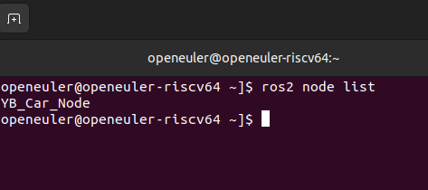
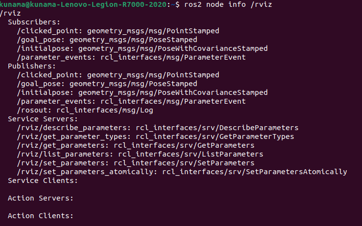

# this is the test report in 25 Oct.

1. ROS domain id set is tested
    
    the communication is avaliable when th domain id is set to 20

    after modify configure.py robot should be reset through hardware

    after modify .bashrc file , `source .bashrc` should be run

    `/YB_Car_node` should be seen if the ros domain id is set right
    

2. Key board controling is tested
    
    Bot is able to control with keyboad with corresponding node is run

3. App mapping test

    App control is aviliable be the map can not be shown on App

    Topics were checked but nothing related to scan was found

4. SLAM mapping test

    Keyboad controlling is avaliable while the map can be show in rviz2

    Topics were check but nothing related to laser was found
    
    

5. Message public is tested 

    Message is able to pulic and succeessfully accept with right ros domain id is set

6. VNC connect is tested

    The VNC connect is not accessable