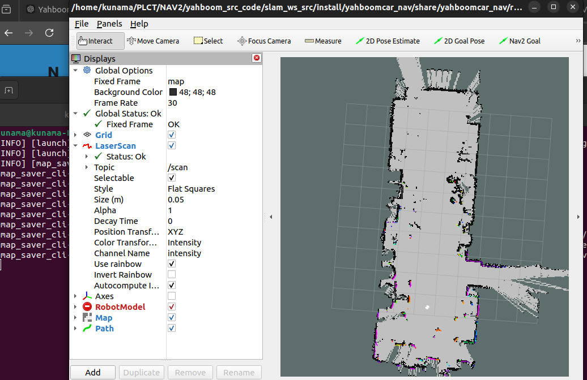
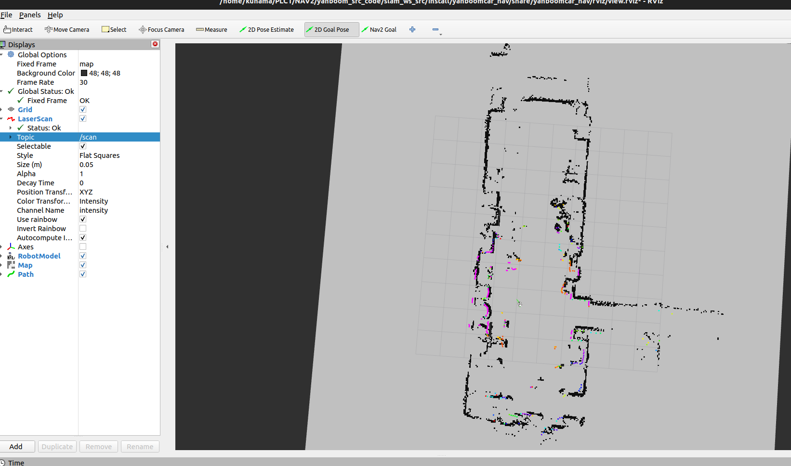
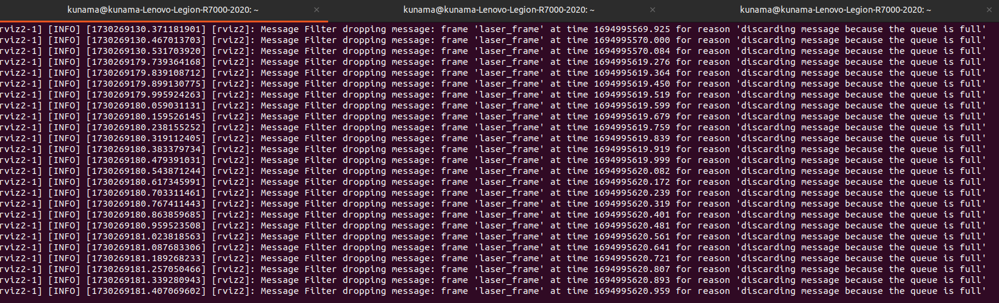
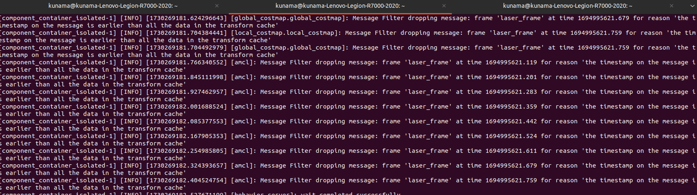
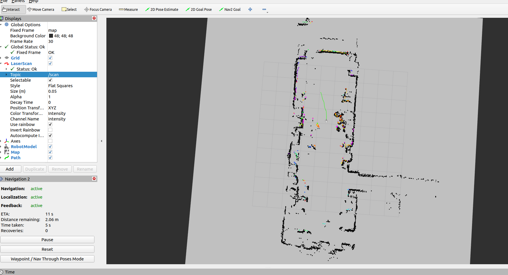
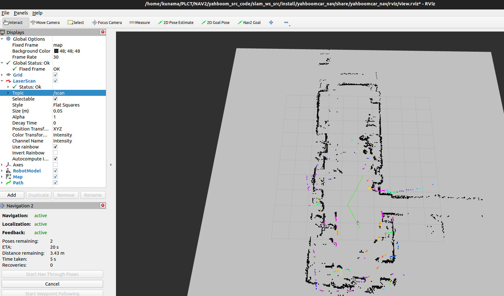

# Test Report 10 26
1. Slam Mapping is tested 
    
    able to run display on rviz 
    
    able to show the detached map on rviz

    
    
    
    notice : 
        
        run keycontrol before mapping launch
        
        run display after mapping launch
        
        otherwise the data might receive inappropriate

        display_launch.py should run on a graphic available platform after properly build with colcon
    
    file modified:
        

    `save_map_launch.py`: ajust `package_path` to proper one 
 

2. Single Point Navigation is tested
    
    able to load the built map 
    
    able to set the goal postion
    
    able to plan a route to the goal position
    
    

    problems still exist: 

    when running `display_launch.py` within `navigation_dwb_launch.py`
    

    when running `navigation_dwb_launch.py`
    

    file modified:
        
    `navigation_dwb_launch.py`: ajust `map_yaml_path` to corresonding path

3. Multiple Point Navigation is tested 

    able to start Nav2 
    able to run multiple point 

    

    

    notice :
    
    reset the board if move the robot manally cause the imu might be affeted. 
    rerun bring up script if needed.