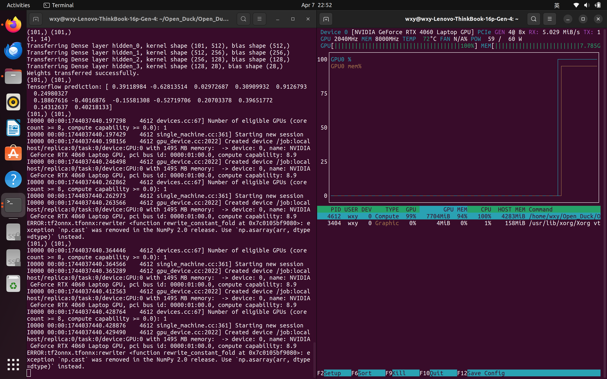
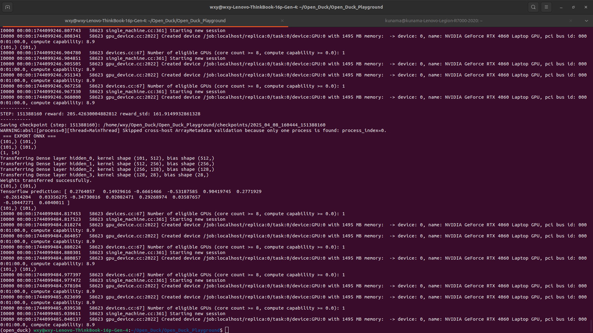

# Open Duck

测试环境：

+ Ubuntu 22.04
+ RTX 4060
+ 13th Gen Intel(R) Core(TM) i9-13900H

原论文 ： https://la.disneyresearch.com/wp-content/uploads/BD_X_paper.pdf

原仓库 ：https://github.com/apirrone/Open_Duck_Mini?tab=readme-ov-file

```
./Open_Duck_Mini/
├── docs
├── experiments
├── FUNDING.yml
├── LICENSE
├── mini_bdx
├── print
├── pyproject.toml
├── README.md
├── setup.cfg
├── thanks.md
└── V2_ROADMAP.md
```

+ `doc:` 文档集合
+ `experiment`: 实验代码
+ `mini_bdx`: 机器人模型
+ `print`: 模型


## 机器人模型

https://github.com/apirrone/Open_Duck_Mini/blob/v2/docs/prepare_robot.md

https://cad.onshape.com/documents/64074dfcfa379b37d8a47762/w/3650ab4221e215a4f65eb7fe/e/0505c262d882183a25049d05

**从onshape获取机器人的urdf**

下载 `onshape-to-robot` ：

```bash
pip install onshape-to-robot
```

创建模型目录:

```
mkdir robot
```

设置相关环境变量：

```
# .bashrc
# Obtained at https://dev-portal.onshape.com/keys
export ONSHAPE_API=https://cad.onshape.com
export ONSHAPE_ACCESS_KEY=Your_Access_Key
export ONSHAPE_SECRET_KEY=Your_Secret_Key
```

或者添加 `.env` 文件：

```
# .env
# Obtained at https://dev-portal.onshape.com/keys
ONSHAPE_API=https://cad.onshape.com
ONSHAPE_ACCESS_KEY=Your_Access_Key
ONSHAPE_SECRET_KEY=Your_Secret_Key
```

添加 `onshape` url 存入 `config.json`: 

```
{ 
    // Onshape URL of the assembly
    "url": <url to onshape model>
    // Output format
    "output_format": "urdf"
}
```

执行

```
onshape-to-robot my-robot
```

在 mujoco 中打开模型：

```
onshape-to-robot-mujoco robot
```

----


也直接通过仓库的文件生成：

```
$ onshape-to-robot ./Open_Duck_Mini/mini_bdx/robots/open_duck_mini_v2
```


-----


仓库中提供了 mujoco 下的 urdf:

```
 ./Open_Duck_Mini/mini_bdx/robots/open_duck_mini_v2/robot.urdf
```

以及对应的 .xml ：

```
 ./Open_Duck_Mini/mini_bdx/robots/open_duck_mini_v2/robot.xml
```

可以在 `mujoco ` 中打开：

```
./bin/simulate <path_to>/Open_Duck_Mini/mini_bdx/robots/open_duck_mini_v2/scene.xml 
```


## 动作生成

参考运动动作生成可以参考仓库：https://github.com/apirrone/Open_Duck_reference_motion_generator  参考运动发生器基于 Placo最终生成对应的 `.pkl` 文件


## 训练和推理

https://github.com/apirrone/Open_Duck_Playground 

训练使用 `tensorboard` ，策略训练在 mujoco playground 的框架下的  [Open Duck Playground](https://github.com/apirrone/Open_Duck_Playground) 进行，模型用各种观测量去生成几个驱动舵机的转角

> 原论文训练环境：
>
> Hardware : Nvidia RTX 4090.
>
> Iterations num : 100 000
>
> dependencies = [
>     "framesviewer>=1.0.2",
>     "jax[cuda12]>=0.5.0",
>     "jaxlib>=0.5.0",
>     "jaxtyping>=0.2.38",
>     "matplotlib>=3.10.0",
>     "mediapy>=1.2.2",
>     "onnxruntime>=1.20.1",
>     "playground>=0.0.3",
>     "pygame>=2.6.1",
>     "tensorflow>=2.18.0",
>     "tf2onnx>=1.16.1",
> ]

在 [joystick](https://github.com/apirrone/Open_Duck_Playground/blob/main/playground/open_duck_mini_v2/joystick.py) 环境下，可以去修改相关的奖励机制，自定义权重，噪声或是随机化参数。

在 `Open_Duck_Playground` 路径下运行：

```
uv run playground/open_duck_mini_v2/runner.py 
```





训练结束后，可以得到 `ONNX.onnx` 模型文件，可以运行脚本在 `mujoco` 上进行推理：

<video src="./pics/mujoco_inference.mp4"></video>


## Sim2real

https://github.com/apirrone/Open_Duck_Mini/blob/v2/docs/sim2real.md

**机器人结构**

在原始Onhape文档中，指定了每个部件的材料。官方使用填充打印匹配了零件的质量

**电机**

官方使用 BAM https://github.com/Rhoban/bam 来对电机建模，官方提供了他们的建模情况：

https://github.com/Rhoban/bam/blob/main/params/feetech_sts3215_7_4V/m1.json

启动机器人前必须进行的操作：https://github.com/apirrone/Open_Duck_Mini_Runtime/blob/v2/checklist.md


## 部署

https://github.com/apirrone/Open_Duck_Mini_Runtime

平台 ： Raspberry Pi zero 2W

OS : https://www.raspberrypi.com/software/operating-systems/

必要依赖：

```
sudo apt update
sudo apt upgrade
sudo apt install git
sudo apt install python3-pip
sudo apt install python3-virtualenvwrapper
```


## 材料参考：

https://docs.google.com/spreadsheets/d/1gq4iWWHEJVgAA_eemkTEsshXqrYlFxXAPwO515KpCJc/edit?gid=0#gid=0