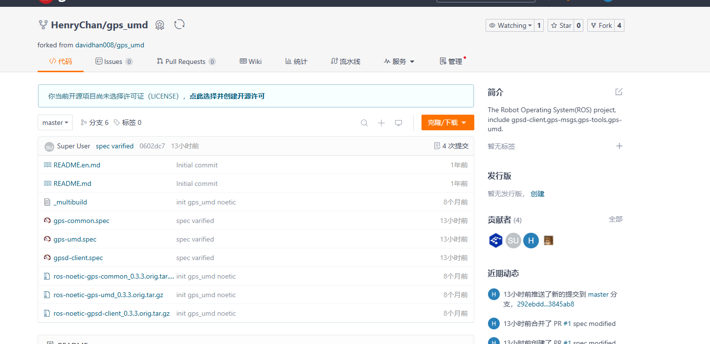
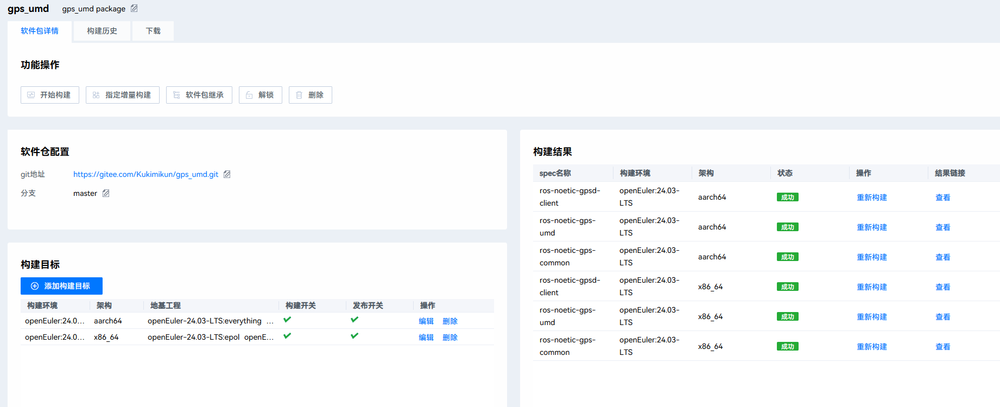

Fork 原始仓库到：[gps_umd: The Robot Operating System(ROS) project, include gpsd-client,gps-msgs,gps-tools,gps-umd. (gitee.com)](https://gitee.com/Kukimikun/gps_umd)



尝试对源码进行编译

从gpsd仓库下clone 对应gpsd版本:

```bash
git clone https://gitlab.com/gpsd/gpsd.git
cd gpsd
git checkout release-3.21
```

利用 `scons`进行构建和安装：

```bash
scons
sudo scons install
```

在对应目录下用make对gpsd_client进构建，可以通过

查看相关库的路径：

```
pkg-config --libs --cflags libgps
```

下载 `gpsd-libs` 和 `gpsd-devel`

```bash
sudo yum install gpsd-libs gpsd-devel
```

修改对应 .spec 文件将

```bash
BuildRequires: libgps
```

修改为：

```bash'
BuildRequires: gpsd-libs
BuildRequires: gpsd-devel
```

并指定lib位置：

```bash
# Manually specify library and include paths for libgps
%build
export CFLAGS="%{optflags} -I/usr/local/include"
export LDFLAGS="-L/usr/local/lib"
export LD_LIBRARY_PATH=/usr/local/lib:$LD_LIBRARY_PATH
%cmake3 ..
%make_build
```

用 rpmbuild 进行构建：

```bash
rpmbuild -ba gpsd-client.spec --define 'ros_distro noetic' 
```

生成日志： [gpsd-client-build-20240912_142730.log](gps_umd\gpsd-client-build-20240912_142730.log) 

修改后的文件重新push到了个人仓库

openMaker编译结果：


