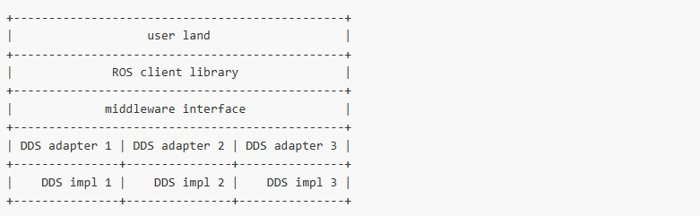
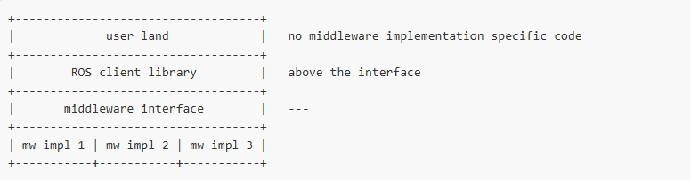
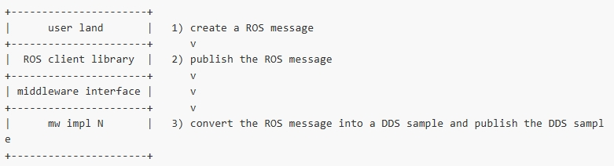
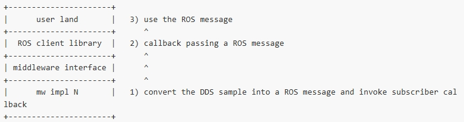
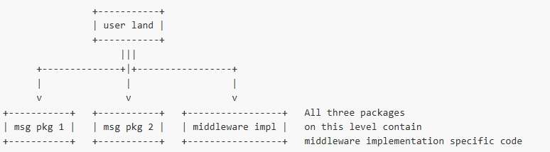
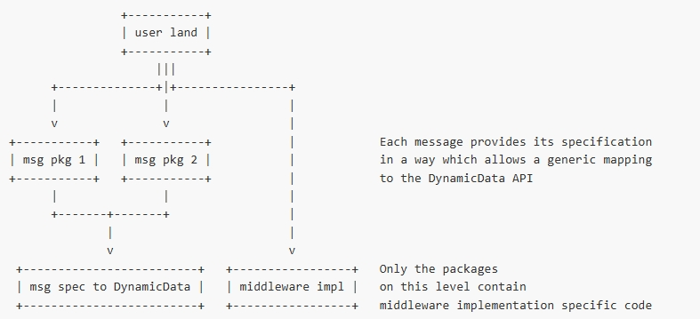

## ROS 2 中间件接口

*本文描述了在 ROS 和特定中间件实现之间使用抽象中间件接口的基本原理，并概述了目标使用案例及其需求和约束。基于这些内容，本文将解释开发的中间件接口。*

作者: Dirk Thomas  

翻译：[Akana-kunama ](https://github.com/Akana-kunama)

撰写日期: 2014-08 

最后修改: 2017-09

### 中间件接口

**为什么 ROS 2 需要中间件接口？**

ROS 客户端库定义了一个 API，向用户公开发布/订阅等通信概念。

在 ROS 1 中，这些通信概念的实现是基于自定义协议（如 TCPROS）构建的。

对于 ROS 2，决定将其构建在现有中间件解决方案（即 DDS）之上。这样做的主要优势是，ROS 2 可以利用现有且经过良好开发的标准实现。

虽然 ROS 可以仅基于一个特定的 DDS 实现构建，但实际上有许多不同的实现可供选择，每种实现都在支持的平台、编程语言、性能特性、内存占用、依赖项和许可方面各有优劣。

因此，尽管每个 DDS 实现的 API 存在细微差异，ROS 仍旨在支持多个 DDS 实现。为了抽象这些 API 的具体差异，引入了一个抽象接口，可以为不同的 DDS 实现进行适配。这个中间件接口定义了 ROS 客户端库与任何特定实现之间的 API。

每个接口的实现通常是一个薄适配器，用于将通用中间件接口映射到中间件实现的具体 API。在下面的讨论中，将省略适配器与实际中间件实现之间的常见区分。



### 为什么中间件接口应该与 DDS 无关？

ROS 客户端库不应向用户暴露任何 DDS 实现的细节。主要目的是隐藏 DDS 规范和 API 内在的复杂性。

虽然 ROS 2 目前只支持基于 DDS 的中间件实现，但仍可以努力保持中间件接口不包含 DDS 特定的概念，这样就能够使用其他中间件实现该接口。这还可以通过结合多个不相关的库（提供发现、序列化和发布/订阅等必要功能）来实现该接口。

这种设计的优势在于保持灵活性和可扩展性，使 ROS 2 不仅限于特定的中间件实现，并允许根据需求替换或扩展中间件技术，而不会影响到 ROS 的核心功能。



### 信息如何通过中间件接口传递

中间件接口的一个关键目标是避免向用户层代码暴露任何 DDS 特定的代码。因此，中间件接口“上层”的 ROS 客户端库仅操作 ROS 数据结构。ROS 2 将继续使用 ROS 消息文件定义这些数据对象的结构，并为每种支持的编程语言派生相应的数据结构。

中间件接口“下层”的中间件实现需要将来自客户端库的 ROS 数据对象转换为其自定义的数据格式，然后传递给 DDS 实现。相反，从 DDS 实现接收到的自定义数据对象必须转换为 ROS 数据对象后，再返回给 ROS 客户端库。

中间件特定数据类型的定义可以从 ROS 消息文件中指定的信息派生出来。通过为 ROS 消息的基本数据类型和中间件特定数据类型定义映射，可以确保双向转换的可能性。在 ROS 类型和实现特定的类型或 API 之间进行转换的功能被封装在“类型支持”中（后面将讨论不同类型支持的细节）。





根据中间件实现，可以通过直接从 ROS 消息实现序列化函数以及将自定义数据反序列化为 ROS 消息的函数，避免额外的转换步骤。这样可以减少处理开销，提高性能，因为跳过了中间格式的转换，直接在 ROS 消息和中间件的传输格式之间进行序列化和反序列化操作。

这种优化方式可以在保证功能完整的同时，提升数据传输的效率，尤其是在高频通信或对性能要求较高的系统中。

### 考虑的使用案例

设计中间件接口时考虑了以下使用案例：

#### 单一中间件实现

ROS 应用程序并不是以单一的方式构建的，而是分布在多个包中。即使有了中间件接口，选择使用哪种中间件实现仍会影响代码的很大一部分。

例如，一个定义 ROS 消息的包需要提供与中间件特定数据类型之间的映射。如果每个定义 ROS 消息的包都采用自定义的（通常是生成的）代码来支持特定的中间件实现，这种实现方式会非常笨重。

在为 ROS 提供二进制包（例如 Debian 包）时，这意味着相当一部分包（至少所有包含消息定义的包）将与所选的中间件实现紧密绑定。这种绑定会带来一定的复杂性，因为不同的中间件实现会需要不同的生成代码，增加了维护和管理的负担。



### 静态 vs. 动态消息类型在 DDS 中的应用

DDS 提供了两种与消息交互的方式：

1. **静态消息类型**：消息可以通过 IDL 文件进行指定，通常由 DDS 实现的特定程序生成源代码。以 C++ 为例，生成的代码包含专门为该消息生成的类型。这样，消息的结构在编译时就固定下来，适用于静态类型定义的场景。
2. **动态消息类型**：消息可以使用 XTypes 规范中的 DynamicData API 进行编程式指定。在这种情况下，不需要 IDL 文件或代码生成步骤。DynamicData API 允许在运行时定义和操作消息类型，提供了更多的灵活性。

尽管仍需要一些自定义代码将 ROS 的 `.msg` 文件中的消息定义映射到 DynamicData API 的调用，但可以编写通用代码来处理任何传入的 ROS `.msg` 规范。这意味着动态类型支持可以为消息的定义和处理提供更大的灵活性，不必依赖编译时生成的特定类型，使得在不同场景下使用 DDS 更为灵活，尤其是在需要运行时动态定义消息结构的情况下。



然而，使用 DynamicData API 的性能可能始终低于静态生成的代码。

### 实现之间的切换

当 ROS 支持多种中间件实现时，用户应能够尽可能轻松、低成本地在它们之间切换。

#### 编译时决定

一种显而易见的方式是用户从源代码构建所有 ROS 包并选择特定的中间件实现。虽然这个工作流程并不复杂（大概只需要执行几个命令行指令），但仍然需要较长的构建时间。

为了避免用户从源代码构建，可以提供一套二进制包，这些包在构建时已经选择了特定的中间件实现。虽然这样减少了用户的工作量，但构建系统需要为每种中间件实现生成一套全新的二进制包。为了支持 N 个包和 M 种中间件实现，构建和维护将需要大量资源（M * N），还需足够的计算能力。

#### 运行时决定

另一种选择是在运行时选择特定的中间件实现。这要求在编译时就支持所有可能的中间件实现，以便为每个消息包生成中间件特定的类型支持。

当为 ROS 构建单一中间件实现时，结果应遵循设计标准：

>不使用的任何功能都不需要消耗资源。

这意味着，为了支持不同的中间件实现，既不应增加构建时间，也不应增加运行时的开销。然而，中间件接口带来的额外抽象仍然是合理的，因为它可以隐藏实现细节，使用户不必关心具体的中间件实现。

### 中间件接口设计

ROS 中间件接口的 API 被设计为基于纯函数的接口，以便用 C 语言实现。纯 C 接口可以用于大多数其他语言（如 Python、Java 和 C++）的 ROS 客户端库，从而避免在不同语言中重新实现核心逻辑的需求。

#### 发布者接口

基于 ROS 节点、发布者和消息的一般结构，对于发布消息的情况，ROS 客户端库需要在中间件接口上调用三个函数：

1. `create_node()`
2. `create_publisher()`
3. `publish()`

##### `create_node` 的基本签名

后续的 `create_publisher` 调用需要引用应该在其中创建的特定节点。因此，`create_node` 函数需要返回一个节点句柄，以便识别该节点。

```c
NodeHandle create_node();
```

##### `create_publisher` 的基本签名

除了节点句柄，`create_publisher` 函数还需要知道话题名称以及话题类型。话题类型参数的类型目前未指定。

后续的 `publish` 调用需要引用它们应该在哪个发布者上发送消息。因此，`create_publisher` 函数需要返回一个发布者句柄，以便识别该发布者。

```c
PublisherHandle create_publisher(NodeHandle node_handle, String topic_name, .. topic_type);
```

话题类型参数封装的信息在很大程度上依赖于中间件实现。

##### DynamicData API 的话题类型信息

使用 DynamicData API 时，没有 C / C++ 类型可以表示类型信息。相反，话题类型必须包含描述消息格式所需的所有信息，包括：

- 消息定义所在的包的名称
- 消息的名称
- 消息字段列表，每个字段包括：
  - 字段名称
  - 字段类型（可以是内置类型或其他消息类型，可选地是无界、有限或固定大小的数组）
  - 默认值
  - 消息中定义的常量列表（同样由名称、类型和值组成）

在使用 DDS 时，这些信息使得可以：

- 以编程方式创建表示消息结构的 DDS `TypeCode`
- 将 DDS `TypeCode` 注册到 DDS Participant 中
- 创建 DDS Publisher、DDS Topic 和 DDS DataWriter
- 将数据从 ROS 消息转换为 DDS DynamicData 实例
- 将 DDS DynamicData 写入 DDS DataWriter

##### 静态生成代码的话题类型信息

使用从 IDL 派生的静态生成代码时，存在 C / C++ 类型来表示类型信息。生成的代码包含以下功能：

- 创建表示消息结构的 DDS `TypeCode`

由于特定类型必须在编译时定义，其他功能不能以通用的方式实现（即与实际消息无关）。因此，每个消息的代码必须单独生成以执行以下任务：

- 将 DDS `TypeCode` 注册到 DDS Participant
- 创建 DDS Publisher、DDS Topic 和 DDS DataWriter
- 将数据从 ROS 消息转换为 DDS DynamicData 实例
- 将 DDS DynamicData 写入 DDS DataWriter

话题类型封装的信息必须包括调用这些函数的函数指针。

##### `get_type_support_handle`

由于话题类型参数封装的信息对于每个中间件实现都有很大不同，因此它实际上是通过中间件接口的一个附加函数来获取的：

```c
MessageTypeSupportHandle get_type_support_handle();
```

目前，该函数是一个模板函数，专用于特定的 ROS 消息类型。为了兼容 C，将使用宏方法，该宏将类型名称嵌入到函数名称中。

##### `publish` 的基本签名

除了发布者句柄外，`publish` 函数还需要知道要发送的 ROS 消息。

```c
publish(PublisherHandle publisher_handle, .. ros_message);
```

由于 ROS 消息没有通用的基类，函数的签名不能使用已知类型来传递 ROS 消息。相反，消息被作为 `void` 指针传递，实际实现会根据之前注册的类型对其进行解释。

##### 返回句柄的类型

返回的句柄需要为每个中间件实现封装任意内容。因此，这些句柄从用户的角度来看是不可透明的对象。只有创建它的中间件实现知道如何解释其内容。

为了确保这些信息传递回同一个中间件实现，每个句柄编码了一个唯一的标识符，中间件实现可以在解释句柄内容之前进行检查。

#### 订阅者接口

订阅者接口所需的详细信息尚未在本文档中描述。

#### 可选地公开本地句柄

RMW 接口仅公开与中间件无关的句柄。但中间件实现可以选择提供附加的 API 来公开本机句柄。例如，对于给定的 ROS 发布者句柄，特定的实现可以提供一个 API 来访问与该发布者相关的中间件特定句柄。

虽然使用这种功能会使用户代码特定于中间件实现，但它为用户提供了一种方式来使用 ROS API 中未公开的中间件功能。参见[这个示例](https://github.com/osrf/ros_dds)以获取更多信息。

### 当前实施

所述概念已在以下软件包中实现：

- [软件包 rmw](https://github.com/ros2/rmw/tree/master/rmw) 定义了中间件接口。
  - 这些函数在 [rms/rmw.h](https://github.com/ros2/rmw/blob/master/rmw/include/rmw/rmw.h) 中声明。
  - 句柄在 [rmw/types.h](https://github.com/ros2/rmw/blob/master/rmw/include/rmw/types.h) 中定义。
- 该软件包[rosidl_typesupport_introspection_cpp](https://github.com/ros2/rosidl/tree/master/rosidl_typesupport_introspection_cpp)生成代码，该代码封装了每个 ROS msg 文件中的信息，使数据结构可以从C++代码中内省。
- 软件包 [rmw_fastrtps_cpp](https://github.com/ros2/rmw_fastrtps/tree/master/rmw_fastrtps_cpp) 基于内省类型支持，使用 [eProsima Fast-RTPS](http://www.eprosima.com/index.php/products-all/eprosima-fast-rtps) 实现中间件接口。
- 软件包[rosidl_generator_dds_idl](https://github.com/ros2/rosidl_dds/tree/master/rosidl_generator_dds_idl)基于 ROS msg 文件生成 DDS IDL 文件，所有基于 DDS 的 RMW 实现都使用静态/编译类型的消息类型。
- 该软件包 [rmw_connext_cpp](https://github.com/ros2/rmw_connext/tree/master/rmw_connext_cpp) 使用基于静态生成的代码的 [RTI Connext DDS](http://www.rti.com/products/dds/index.html) 实现中间件接口。
  - 该软件包[rosidl_typesupport_connext_cpp](https://github.com/ros2/rmw_connext/tree/master/rosidl_typesupport_connext_cpp)生成：
    - 基于每条消息的 IDL 文件的 DDS 特定代码
    - 用于为每种消息类型启用 Register/Create/Convert/Write 函数的附加代码
- [rmw_connext_dynamic_cpp](https://github.com/ros2/rmw_connext/tree/master/rmw_connext_dynamic_cpp) 软件包基于 Connext 的 API 和 introspection type 支持，使用 *RTI Connext DDS* 实现中间件接口。`DynamicData`
- 该软件包[rmw_opensplice_cpp](https://github.com/ros2/rmw_opensplice/tree/master/rmw_opensplice_cpp)使用 [PrismTech OpenSplice DDS](http://www.prismtech.com/opensplice) 基于静态生成的代码实现中间件接口。
  - [rosidl_typesupport_opensplice_cpp](https://github.com/ros2/rmw_opensplice/tree/master/rosidl_typesupport_opensplice_cpp)生成的包：
    - 基于每条消息的 IDL 文件的 DDS 特定代码
    - 用于为每种消息类型启用 Register/Create/Convert/Write 函数的附加代码
- [rmw_implementation](https://github.com/ros2/rmw_implementation/tree/master/rmw_implementation) 包提供了在中间件实现的编译时和运行时选择之间切换的机制。
  - 如果在编译时只有一个 implementation 可用，则它会直接链接到该 implementation。
  - 如果在编译时有多个实现可用，则它会实现中间件接口本身，并通过加载在运行时由环境变量标识的特定中间件实现的共享库来根据策略模式执行操作，并传递所有调用。

#### 一个或多个类型支持生成器

在消息生成过程中贡献的包称为类型支持生成器。它们的包名以 `rosidl_typesupport_` 为前缀。

每个消息包将包含所有可用类型支持生成器生成的代码。这可以是一个（当仅构建针对单一中间件实现时）或多个类型支持生成器。

#### DDS 与 ROS 概念的映射

- 每个 ROS 节点对应一个 DDS participant。如果多个 ROS 节点在一个进程中运行，它们仍映射到不同的 DDS participant。如果包含的进程暴露自己的 ROS 接口（例如，运行时加载节点），它本身也作为一个 ROS 节点，并映射到一个独立的 DDS participant。
- ROS 的发布者和订阅者映射到 DDS 的发布者和订阅者。DDS 的 DataReader、DataWriter 以及话题不会通过 ROS API 暴露。
- ROS API 定义的队列大小和一些服务质量参数会映射到 DDS 的对应项。其他 DDS QoS 参数不会通过 ROS API 公开。

