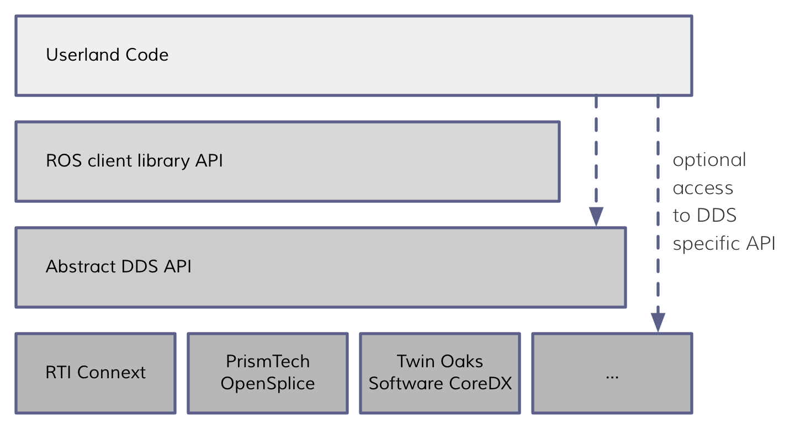
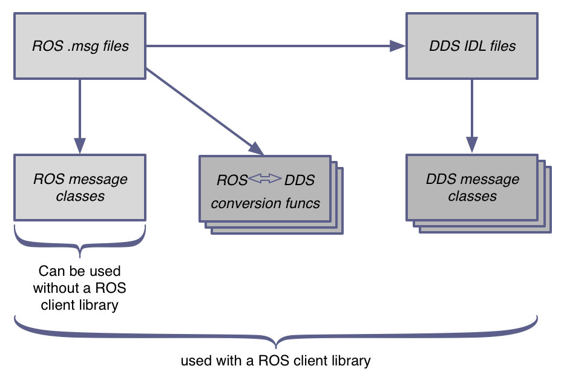

## DDS 上的 ROS

*本文是在决定使用 DDS 和 RTPS 作为 ROS 2 的基础通信标准之前撰写的。 有关如何实现 ROS 2 的详细信息，请参阅[核心文档](http://docs.ros2.org/)*

*本文提出了使用 DDS 作为 ROS 中间件的案例，概述了这种方法的优缺点，并考虑了使用 DDS 对用户体验和代码 API 的影响。“ros_dds”原型的结果也被总结并用于对该问题的探索。*

作者： [William Woodall](https://github.com/wjwwood)

翻译：[Akana-kunama ](https://github.com/Akana-kunama)

写于：2014-06

上次修改时间：2019 年 7 月

相关术语连接：

- [数据分发服务 （DDS）](http://en.wikipedia.org/wiki/Data_Distribution_Service)

- [实时发布订阅 （RTPS）](https://en.wikipedia.org/wiki/Real-Time_Publish-Subscribe_(RTPS)_Protocol)

- [对象管理组 （OMG）](http://www.omg.org/)

- | OMG [接口描述语言 （IDL）](http://www.omg.org/gettingstarted/omg_idl.htm) | [正式描述](http://www.omg.org/cgi-bin/doc?formal/2014-03-01) |
  | ------------------------------------------------------------ | ------------------------------------------------------------ |

### 为什么考虑 DDS

在探索ROS下一代通信系统的选项时，初步选择是改进ROS 1的传输系统或使用 [ZeroMQ](http://zeromq.org/)、Protocol Buffers和zeroconf（Bonjour/Avahi）等组件库构建新的中间件。然而，除了这些选项外，我们还考虑了其他端到端的中间件。在研究过程中，DDS作为一种中间件脱颖而出。

#### 端到端的中间件的好处：

使用端到端中间件（如DDS），维护的代码更少，中间件的行为和具体规范已经被详细地记录在文档中。除了系统级文档外，DDS还有推荐的使用案例和软件API。有了这些具体的规范，第三方可以审查、审核并实现具有不同互操作性程度的中间件。这是ROS之前所没有的，除了在wiki中的一些基本描述和一个参考实现。此外，如果要从现有库中构建新的中间件，还需要创建这种类型的规范。

### DDS是什么： 

DDS提供了一种发布-订阅的传输方式，与ROS的发布-订阅传输非常相似。DDS使用由[对象管理组 （OMG）](http://www.omg.org/)定义的“接口描述语言（IDL）”进行消息定义和序列化。，截至 2016 年 6 月，DDS处于 beta 2 阶段，拥有类似于ROS的服务系统的请求-响应式传输方式。（称为 [DDS-RPC）](http://www.omg.org/spec/DDS-RPC/)。

DDS提供的默认发现系统是一种分布式发现系统，它是使用DDS的发布-订阅传输所必需的。这使得任何两个DDS程序都可以在没有ROS master这样的工具的情况下进行通信，使系统更具容错性和灵活性。然而，使用动态发现机制并非必需，因为多个DDS供应商提供了静态发现的选项。

### DDS 从何而来：

DDS 最初是由一组拥有类似中间件框架的公司组成的，后来由于共同的客户希望在不同供应商之间实现更好的互操作性，它逐渐成为了一个标准。DDS 标准是由对象管理组织（Object Management Group）创建的，OMG 也是为我们带来 UML、CORBA、SysML 以及其他通用软件相关标准的组织。在你的观点中，这可能是一个正面的，也可能是一个负面的。一方面，你有一个常年存在的标准委员会，它显然对软件工程社区有着巨大的影响力；但另一方面，这个委员会的反应较为缓慢，适应变化的速度较慢，因此可能并没有跟上软件工程领域的最新趋势。

DDS 最初是几个相似的中间件，随着它们之间的差异逐渐缩小，制定一个统一的标准变得合理。因此，尽管 DDS 规范是由一个委员会编写的，但它是根据用户的需求逐步演变而来的。这种在规范正式确定之前的有机演化，有助于消除人们的担忧，即该系统是否是在与现实环境脱节的情况下设计的，以及它是否能在真实环境中良好运行。有些委员会制定的规范虽然意图良好、描述清晰，但却无人愿意使用，或者无法满足其服务的社区的需求，但这似乎并不是 DDS 的情况。

此外，有人担心 DDS 是一个静态规范，它被定义并用于“遗留”系统，但未能保持与时俱进。这种刻板印象来源于一些关于同样是 OMG 的产物的UML 和 CORBA 的故事。然而，DDS 似乎拥有一个活跃且有机的规范，最近还增加或正在增加更多的规范，例如 websockets 支持、通过 SSL 的安全性、可扩展类型、请求和响应传输，以及一个新的、更现代的 C++11 风格核心 API 规范，以取代现有的 C++ 接口。在 DDS 标准化组织中，这种演变是令人鼓舞的，尽管该组织与软件工程技术趋势相比相对缓慢，但它正在不断发展，以满足用户的需求。

### 技术可信度

DDS 拥有广泛且多样化的使用案例，且多用于关键任务系统。当前DDS 已被应用于以下领域：

- 战舰
- 大型公用设施（如水坝）
- 金融系统
- 太空系统
- 航空系统
- 火车调度系统

以及其他同样重要和多样化的场景，这些成功的使用案例提高了 DDS 设计的可靠性和灵活性的可信度。

DDS 不仅满足了上述用例的需求，在与 DDS 用户（例如政府和 NASA 员工，他们也是 ROS 用户）交谈，时，他们都对 DDS 的可靠性和灵活性表示赞赏，但同时这些用户同样指出，DDS 的灵活性伴随着复杂性的增加。DDS 的 API 和配置的复杂性是 ROS 需要解决的问题。

DDS 的线传输规范（[DDSI-RTPS](http://www.omg.org/spec/DDSI-RTPS/)）极具灵活性，允许其用于可靠的高级系统集成以及嵌入式设备上的实时应用。几家 DDS 供应商为嵌入式系统开发了特殊版本的 DDS，其库大小和内存占用量通常只有几十或几百 KB。由于 DDS 默认基于 UDP 实现，它不依赖于可靠的传输或硬件进行通信。这意味着 DDS 需要重新发明可靠性的机制（基本上是类似 TCP 的一些功能），但换来的好处是 DDS 获得了可移植性和对行为的控制。DDS 的可靠性控制参数（称为服务质量，QoS）提供了最大的灵活性来控制通信行为。例如，如果你关心延迟（例如软实时系统），你可以将 DDS 调整为基本上像 UDP 发送器一样。在另一个场景中，你可能需要一个类似 TCP 的行为，但需要对长时间丢包更加容忍，而在 DDS 中，这些都可以通过更改 QoS 参数来控制。

尽管 DDS 默认是基于 UDP 实现的，并且只要求传输层提供这种功能，但 OMG 在其 1.2 版本规范中还为 DDS 增加了对 TCP 的支持。简要浏览后可以发现，两家供应商（RTI 和 ADLINK Technologies）均支持基于 TCP 的 DDS。

来自 RTI 网站的说明（http://community.rti.com/kb/xml-qos-example-using-rti-connext-dds-tcp-transport）：

> 默认情况下，RTI Connext DDS 使用 UDPv4 和共享内存传输与其他 DDS 应用程序进行通信。 在某些情况下，可能需要 TCP 协议进行发现和数据交换。 有关 RTI TCP 传输的更多信息，请参阅 RTI 核心库和实用程序用户手册中标题为“RTI TCP 传输”的部分。

来自 ADLINK 网站，他们自 OpenSplice v6.4 版本开始支持 TCP：https://www.adlinktech.com/en/data-distribution-service.aspx

### 供应商和许可

OMG 与几家公司一起定义了 DDS 规范，这些公司现在是主要的 DDS 供应商。 受欢迎的 DDS 供应商包括：

- RTI
- 凌华科技(ADLINK Technologies)
- Twin Oaks 软件

在这些供应商中，有一系列具有不同策略和许可证的参考实现。 OMG 维护着 DDS 供应商的活动[列表](http://dds-directory.omg.org/vendor/list.htm)。

除了提供 DDS 规范 API 的实现的供应商外，还有一些软件供应商提供对 DDS 有线协议 RTPS 的更直接访问的实现。 例如：

- eProsima

这些以 RTPS 为中心的实现也很有趣，因为它们的范围可能更小，并且仍然提供在顶部实现必要的 ROS 功能所需的功能。

RTI 的 Connext DDS 可在定制的“社区基础设施”许可证下使用，该许可证与 ROS 社区的需求兼容，但需要与社区进一步讨论，以确定其作为 ROS 默认 DDS 供应商的可行性。 “兼容 ROS 社区的需求”是指，虽然它不是 [OSI 批准的许可证](https://opensource.org/licenses)，但研究表明，它允许 ROS 保留 BSD 风格的许可证，并允许 ROS 社区中的任何人以源代码或二进制形式重新分发它。 RTI 似乎也愿意就许可证进行谈判以满足 ROS 社区的需求，但 ROS 社区和 RTI 之间需要一些迭代才能确保这能够奏效。 与其他供应商一样，此许可证可用于核心功能集，基本上是基本的 DDS API，而他们产品的其他部分（如开发和内省工具）是专有的。 RTI 似乎拥有最大的在线业务和安装基础。

凌华科技的 DDS 实现 OpenSpl 根据 LGPL 获得许可，该许可与许多流行的开源库（如 glibc、ZeroMQ 和 Qt）使用的许可证相同。 它在 [Github](https://github.com/) 上可用：

https://github.com/ADLINK-IST/opensplice

凌华科技的实现带有一个基本的、功能齐全的构建系统，并且相当容易打包。 OpenSplice 似乎是第二大正在使用的 DDS 实现，但很难确定。

TwinOaks 的 CoreDX DDS 实现只是专有的，但显然他们专注于能够在嵌入式设备甚至裸机上运行的最小实现。

eProsima 的 FastRTPS 实施可在 GitHub 上获得，并且已获得 LGPL 许可：

https://github.com/eProsima/Fast-RTPS

eProsima Fast RTPS 是一种相对较新的轻量级开源 RTPS 实现。 它允许直接访问 RTPS 协议设置和功能，而其他 DDS 实现并不总是能够做到这一点。 eProsima 的实现还包括最低限度的 DDS API、IDL 支持和自动代码生成，他们愿意与 ROS 社区合作以满足他们的需求。

考虑到相对强大的 LGPL 选项以及 RTI 提供的鼓舞人心但定制的许可，依赖并分发 DDS 作为依赖项应该是可行的。本提案的目标之一是使 ROS 2 对 DDS 供应商保持独立。 因此，举个例子，如果默认实现是 Connext，但有人想使用 OpenSpl 或 FastRTPS 等 LGPL 选项之一，他们只需要重新编译 ROS 源代码，并翻转一些选项，他们就可以使用他们选择的实现。

这一点之所以成为可能，是因为 DDS 在其规范中定义了 API。 研究表明，制作与供应商相对独立的代码是可行的，尽管有些困难，因为不同供应商的 API 几乎相同，但存在一些细微差异，比如返回类型（指针与类似 shared_ptr 的东西）和头文件组织方式。

### 理念与社区

DDS 来自于一组拥有几十年历史的公司，由老派的软件工程组织 OMG 制定，主要被政府和军事用户使用。因此，DDS 的社区与 ROS 社区及类似现代软件项目（如 ZeroMQ）看起来有很大的不同也不足为奇。尽管 RTI 在网上有着一定的影响力，社区成员提出的问题也几乎总是由 RTI 的员工回答，而且从技术上讲，RTI 和 OpenSplice 都是开源的，但他们没有花时间为 Ubuntu、Homebrew 或其他现代包管理器提供软件包。他们也没有广泛的用户贡献维基或活跃的 Github 仓库。

社区之间这种强烈的精神差异是依赖 DDS 最令人担忧的问题之一。 与保留 TCPROS 或使用 ZeroMQ 等选项不同，DDS 并没有感觉有一个庞大的社区可以依靠。 然而，在我们的研究过程中，DDS 供应商对我们的询问非常敏感，很难说当 ROS 社区提出问题时，这种情况是否会继续下去。

尽管这一点在决定是否使用 DDS 时应被考虑，但不应过度影响对 DDS 提案的技术优劣权衡。

### 基于 DDS 构建 ROS

目标是使 DDS 成为 ROS 2 的实现细节。 这意味着需要隐藏所有特定于 DDS 的 API 和消息定义。 DDS 提供发现、消息定义、消息序列化和发布-订阅传输。 因此，DDS 将为 ROS 提供发现、发布-订阅传输，以及至少底层消息序列化。 ROS 2 将在 DDS 之上提供类似 ROS 1 的接口，为大多数 ROS 用户隐藏了 DDS 的复杂部分，但随后为具有极端用例或需要与其他现有 DDS 系统集成的用户提供对底层 DDS 实现的的访问权限。

*DDS和ROS API布局*

访问 DDS 实现将需要依赖额外的，但通常不常用的包。通过查看包的依赖关系，你可以判断一个包是否与特定的 DDS 供应商绑定。ROS API 的目标是在 DDS 之上满足 ROS 社区的所有常见需求，因为一旦用户进入底层 DDS 系统，他们将失去在 DDS 供应商之间的兼容性。DDS 供应商之间的兼容性性并不是为了鼓励用户频繁选择不同的供应商，而是为了使高级用户能够选择满足其特定需求的 DDS 实现，以及使 ROS 能够适应 DDS 供应商选项的变化。ROS 会有一个推荐的、最佳支持的默认 DDS 实现。

#### 发现机制

DDS 将完全取代基于 ROS master 的发现系统。 ROS 需要利用 DDS API 来获取所有节点的列表、所有主题的列表以及它们的连接方式等信息。 访问此信息将隐藏在 ROS 定义的 API 后面，从而防止用户必须直接调用 DDS。

DDS 发现系统的优点是，默认情况下，它是完全分布式的，因此系统的各个部分之间没有相互通信所需的中心故障点。 DDS 还允许在其发现系统中使用用户定义的元数据，这将使 ROS 能够将更高级别的概念搭载到发布-订阅中。

#### 发布-订阅传输

DDSI-RTPS（DDS-互操作实时发布订阅）协议将取代 ROS 的 TCPROS 和 UDPROS 线协议。DDS API 为 ROS 1 的典型发布-订阅模式引入了更多的参与者。在 ROS 中，节点的概念最能与 DDS 中的图参与者相匹配。一个图参与者可以有多个话题，话题类似于 ROS 中的概念，但在 DDS 中它们作为独立的代码对象存在，既不是订阅者也不是发布者。然后可通过DDS主题创建DDS订阅者和发布者，但它们并不直接从话题读取数据或向话题写入数据。DDS 还有“数据读取器”和“数据写入器”的概念，它们在订阅者或发布者中创建，并在使用前专门用于特定消息类型。DDS 提供了这种层次化的抽象，使得在发布-订阅栈中的每一层都可以设置 QoS（服务质量）参数，实现了最细粒度的配置。这些抽象层对 ROS 的当前需求大多是不必要的，因此 ROS 2 会通过简化的 ROS 风格接口（如 Node、Publisher 和 Subscriber）包装常见的工作流，以隐藏 DDS 的复杂性，同时开放部分功能。

#### 高效传输替代方案

在 ROS 1 中，从未有过标准的共享内存传输，因为它比本地主机 TCP 环回连接的速度快不了多少。通过零拷贝共享内存在进程间传递数据可以获得显著的性能提升，在 ROS 1 中，当任务需要比本地主机 TCP 更快的速度时，通常使用 nodelet。Nodelet 允许发布者和订阅者通过传递 `boost::shared_ptr` 来共享消息数据。这种进程内通信几乎肯定比任何进程间通信更快，与网络发布-订阅实现无关。

在 DDS 上下文中，大多数供应商将透明地使用共享内存优化消息流量（即使在进程之间），只有在离开本地主机时才使用线协议和 UDP 套接字。这为 DDS 提供了显著的性能提升，而在 ROS 1 中并没有这种优势，因为本地主机网络优化发生在 `send` 调用时。对于 ROS 1，过程是：将消息序列化为一个大缓冲区，然后一次调用 TCP 的 `send`。对于 DDS，过程更像是：将消息序列化，拆分成多个 UDP 包，多次调用 UDP 的 `send`。因此，发送多个 UDP 数据报没有一次发送大型 TCP 缓冲区的速度快。因此，许多 DDS 供应商将对本地主机消息进行优化，使用黑板式共享内存机制在进程间高效通信。

然而，并非所有 DDS 供应商都在这一点上相同，因此 ROS 不会依赖这种“智能”行为来实现高效的进程内通信。此外，如果保留 ROS 消息格式（将在下一部分讨论），则无法避免为进程内话题进行 DDS 消息类型的转换。因此，ROS 需要开发一个自定义的进程内通信系统，该系统不会序列化或转换消息，而是通过 DDS 话题在发布者和订阅者之间传递指向共享进程内内存的指针。这个进程内通信机制对于基于 ZeroMQ 的自定义中间件同样适用。

这里要注意的是，无论中间件的网络/进程间实现如何，高效的进程内通信问题都会得到解决。

#### 消息

当前 ROS 消息定义具有很大的价值。格式简单，且这些消息经过机器人社区多年使用的演变。当前 ROS 代码中的许多语义内容都是由这些消息的结构和内容驱动的，因此保留这些消息的格式和内存表示具有重要价值。为了达到这一目标，并使 DDS 成为一个实现细节，ROS 2 应保留 ROS 1 类似的消息定义和内存表示。

因此，ROS 1 的 `.msg` 文件将继续使用，转换为 `.idl` 文件，以便能够与 DDS 传输一起使用。针对 `.msg` 和 `.idl` 文件将分别生成语言特定的文件，并提供在 ROS 和 DDS 内存实例之间进行转换的函数。ROS 2 API 将仅在内存中使用 `.msg` 风格的消息对象，并在发布前将其转换为 `.idl` 对象。

一开始，将消息逐字段转换为另一种对象类型并在每次调用 `publish` 时执行转换，似乎会带来巨大的性能问题，但实验表明，与序列化的成本相比，这种复制的开销微不足道。我们发现，类型转换成本与序列化成本的比例至少有一个数量级的差距，这在我们尝试的每个序列化库中都成立，除了 Cap’n Proto 因为它没有序列化步骤。因此，如果逐字段复制不适用于你的用例，那么序列化和通过网络传输也同样不适用，此时你必须使用进程内通信或零拷贝的进程间通信。

在 ROS 中，进程内通信不会使用 DDS 的内存表示，因此除非数据需要通过网络传输，否则不会使用逐字段复制。由于这种转换仅在与更昂贵的序列化步骤结合时才会调用，因此逐字段复制似乎是为了保持 ROS `.msg` 文件和内存表示的可移植性和抽象性所做的合理权衡。

这并不排除改进 `.msg` 文件格式的选项，比如引入默认值和可选字段。但这是另一种权衡，可以在以后决定。

### 服务与动作

目前，DDS 并没有针对请求-响应式 RPC（远程过程调用）的标准，这种标准可以用于在 ROS 中实现服务的概念。目前，OMG DDS 工作组正在考虑对 RPC 规范进行批准，一些 DDS 供应商也已经实现了该 RPC API 的草案版本。然而，该标准是否适用于动作仍不明确，但至少可以支持 ROS 服务的不可抢占版本。ROS 2 可以选择在发布-订阅的基础上实现服务和动作（在 DDS 中，这更为可行，因为它们有可靠的发布-订阅 QoS 设置），也可以在完成 DDS RPC 规范后将其用于服务，然后在其基础上实现动作，类似于 ROS 1 的实现方式。不管选择哪种方式，动作将在 ROS 2 API 中成为一等公民，并且服务可能只是动作的一种退化形式。

### 语言支持

DDS 供应商通常至少提供 C、C++ 和 Java 的实现，因为 DDS 规范明确定义了这些语言的 API。然而，研究未发现任何成熟的 DDS Python 版本。因此，ROS 2 系统的一个目标是提供一个一流的、功能齐全的 C API。这将使其他语言的绑定更容易实现，并能够在客户端库之间实现更一致的行为，因为它们将使用相同的实现。像 Python、Ruby 和 Lisp 等语言可以在 C API 上封装一个薄的、符合语言惯例的实现。

ROS 的实际实现可以用 C 语言，使用 DDS C API，或者用 C++，使用 DDS C++ API，然后将 C++ 实现封装成 C API 以供其他语言使用。C++ 实现封装成 C 是一种常见的模式，例如 ZeroMQ 就是这样做的。然而，ZeroMQ 的作者在他的新库 nanomsg 中没有采用这种方式，原因是 C++ 标准库依赖带来的复杂性和膨胀。由于 DDS 的 C 实现通常是纯 C 实现，因此可以从 DDS 实现一直到 ROS C API 保持纯 C 实现。不过，将整个系统用 C 编写可能不是首要目标，为了让最小可行产品尽快运作，初始实现可能会使用 C++，然后封装成 C，如果必要的话，之后可以将 C++ 替换为 C。

### DDS 作为依赖

ROS 2 的一个目标是尽可能多地重用现有代码（“不要重新发明轮子”），同时尽量减少依赖项的数量，以提高可移植性并保持构建依赖列表简洁。这两个目标有时是相互冲突的，因为往往需要在内部实现某些功能或依赖外部资源（依赖项）之间做出选择。

在这一点上，DDS 实现有其优势，因为在评估的三家 DDS 供应商中，有两家在 Linux、OS X、Windows 以及其他较为少见的系统上构建时无需外部依赖。C 实现只依赖于系统库，C++ 实现只依赖于 C++03 编译器，而 Java 实现只需要 JVM 和 Java 标准库。在 Ubuntu 和 OS X 上以二进制形式打包的 OpenSplice（LGPL）的 C、C++、Java 和 C# 实现大小不到三兆字节，并且没有其他依赖项。在依赖项方面，这使得 DDS 非常有吸引力，因为它显著简化了 ROS 的构建和运行依赖。此外，由于目标是使 DDS 成为实现细节，因此它可能作为传递运行时依赖项被移除，这意味着它甚至不需要在部署的系统上安装。

### ROS on DDS 原型

在研究了 ROS 基于 DDS 的可行性之后，仍然有几个问题悬而未决，包括但不限于：

- ROS 1 的 API 和行为能否在 DDS 之上实现？
- 将 ROS MSG 消息生成 IDL 消息并与 DDS 一起使用是否可行？
- 将 DDS 实现作为依赖项打包有多难？
- DDS API 规范是否真正实现了 DDS 供应商的可移植性？
- 配置 DDS 有多难？

为了回答这些问题，在此仓库中创建了一个原型和多个实验：

https://github.com/osrf/ros_dds

更多问题和部分结果被记录为问题：

https://github.com/osrf/ros_dds/issues?labels=task&page=1&state=closed

该仓库的主要工作在原型文件夹中，这是使用 DDS 实现的类似于 ROS 1 的 Node、Publisher 和 Subscriber API：

https://github.com/osrf/ros_dds/tree/master/prototype

具体来说，该原型包括以下包：

- 从 .msg 文件生成 DDS IDL 文件：https://github.com/osrf/ros_dds/tree/master/prototype/src/genidl
- 为每个生成的 IDL 文件生成 DDS 特定的 C++ 代码：https://github.com/osrf/ros_dds/tree/master/prototype/src/genidlcpp
- 用于 C++ 的最小 ROS 客户端库（rclcpp）：https://github.com/osrf/ros_dds/tree/master/prototype/src/rclcpp
- 发布-订阅和服务调用的 talker 和 listener 示例：https://github.com/osrf/ros_dds/tree/master/prototype/src/rclcpp_examples
- 修改后基于 rclcpp 库构建的 turtlesim 分支：https://github.com/ros/ros_tutorials/tree/ros_dds/turtlesim

该 turtlesim 分支尚未完全实现所有功能（如服务和参数尚不支持），但基本功能已经有效，它展示了从 ROS 1 的 roscpp 过渡到 ROS 2 的 rclcpp 原型所需的更改并不剧烈。

这是一个快速原型，用来回答问题，因此它并不代表最终产品，也没有经过精细打磨。一旦关键问题得到解答，某些功能的开发便停止了。

rclcpp_example 包中的示例表明，可以在 DDS 之上实现基本的 ROS API 并获得熟悉的行为。尽管这不是完整的实现，并未覆盖所有功能，但它的教育意义重大，解决了大多数关于使用 DDS 的疑虑。

生成 IDL 文件过程中遇到了一些难点，但最终都得以解决，实现诸如服务等基本功能的问题也是可处理的。

除了上述基本部分，还起草了一个 Pull Request，它成功地将 DDS 符号从 rclcpp 和 std_msgs 的任何公共安装头文件中完全隐藏：

https://github.com/osrf/ros_dds/pull/17

该 Pull Request 最终没有合并，因为它是代码结构的重大重构，而在此期间已经取得了其他进展。然而，它实现了其目的，展示了可以隐藏 DDS 实现，尽管关于如何实现这一目标还有讨论的空间。

### 结论

在使用 DDS 之后，尽管对其理念、社区和许可持有一定的怀疑态度，但很难提出任何真正的技术性批评。尽管 DDS 周围的社区与 ROS 或 ZeroMQ 的社区截然不同，但 DDS 似乎是一种稳固的技术，ROS 可以依赖它。关于 ROS 如何具体利用 DDS 还有许多问题，但目前来看，这些问题都更像是工程上的挑战，而不是 ROS 潜在的决策阻碍。