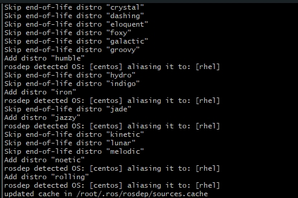

# MoveIt on openEuler

- **文档说明：**

  - Tutorials: 创建你的第一个Movelt工程
  - How-to Guide: 回答“如何用Movelt去完成 X”
  - Concepts: 介绍Movelt的设计
  - Contribution: 介绍如对Movelt进行修改
  - API Documentaion: 去往API 参考链接

## 开始：

首先需要进行环境的设置，以便最好的运行相关教程案例。这将创建一个colcon工作区，下载最新的Movelt源代码，并从中构建所有内容，确保一切都是最新的。

根据使用的计算机的CPU 以及可用的RAM，构建Movelt的源码需要20-30分钟，如果使用的系统性能较差，或者想要更快速的入門，可以参考Docker Guide


**ROS2 和 colcon的安装**

> **ROS2的安装：**
>
> openEuler 上的ROS2的安装可以参考：https://github.com/Akana-kunama/PLCT_Kunama/blob/main/start/start.md

ROS2安装完成后，记得source一下：`source /opt/ros/<version that you installed>/setup.bash`

> **colcon的安装：**
>
> openEuler 上colcon的安装需要从源码进行下载，首先通过python3进行相关依赖的下载：
>
> ```bash
> sudo dnf install python3-pip python3-setuptools
> pip3 install vcstool
> ```
>
> 依赖下载完成后，创建colcon workspace用于克隆colcon的源码，并进行源码的clone：
>
> ```bash
> mkdir -p ~/colcon_ws/src
> cd ~/colcon_ws/src
> 
> # Clone colcon core
> git clone https://github.com/colcon/colcon-core.git
> 
> # Clone colcon extensions
> git clone https://github.com/colcon/colcon-common-extensions.git
> ```
>
> clone结束后，通过pip3进行colcon的安装：
>
> ```bash
> cd ~/colcon_ws
> pip3 install ./src/colcon-core
> pip3 install ./src/colcon-common-extensions
> ```
>
> 随后进行mixin的更行：
>
> ```bash
> colcon mixin add default https://raw.githubusercontent.com/colcon/colcon-mixin-repository/master/index.yaml
> colcon mixin update default
> ```
>
> 若githubusercontent连接不上，可以使用gittee的连接：
>
> ```bash
> colcon mixin add default https://gitee.com/zhenshenglee/colcon-mixin-repository/raw/master/index.yaml
> colcon mixin update default
> ```

ROS2和colcon安装结束后，需要通过rosdep进行相关依赖的安装：

> 首先进行rosdep的初始化：`sudo rosdep init`
>
> 由于rosdep暂时不支持openEuler，需要进行以下操作：
>
> ```bash
> echo 'export ROS_OS_OVERRIDE=centos:7' >> ~/.bashrc
> source ~/.bashrc
> ```
>
> 或者修改`os_detect.py`文件中的`get_name`、`get_version`函数：
>
> ```python
> def get_name(self):
> 	return "centos"
> 
> def get_version(self):
> 	return "7"
> ```
>
> 修改结束后，进行update：`sudo rosdep update`
>
> update 结束后如下：
>
> 
>
> 若出现`raw.githubusercontent.com`访问困难，可以将 `/etc/ros/rosdep/sources.list.d/20-default.list`  文件内容替换为：
>
> ```bash
> # os-specific listings first                                                                                                        
> # yaml https://raw.githubusercontent.com/ros/rosdistro/master/rosdep/osx-homebrew.yaml osx                                             
> yaml https://mirrors.tuna.tsinghua.edu.cn/github-raw/ros/rosdistro/master/rosdep/osx-homebrew.yaml                                     
>                                                                                                                                        
> # generic                                                                                                                              
> # yaml https://raw.githubusercontent.com/ros/rosdistro/master/rosdep/base.yaml                                                         
> yaml https://mirrors.tuna.tsinghua.edu.cn/github-raw/ros/rosdistro/master/rosdep/base.yaml                                             
>                                                                                                                                        
> # yaml https://raw.githubusercontent.com/ros/rosdistro/master/rosdep/python.yaml                                                       
> yaml https://mirrors.tuna.tsinghua.edu.cn/github-raw/ros/rosdistro/master/rosdep/python.yaml                                           
>                                                                                                                                        
> # yaml https://raw.githubusercontent.com/ros/rosdistro/master/rosdep/ruby.yaml                                                         
> yaml https://mirrors.tuna.tsinghua.edu.cn/github-raw/ros/rosdistro/master/rosdep/ruby.yaml                                             
>                                                                                                                                        
> # gbpdistro https://raw.githubusercontent.com/ros/rosdistro/master/releases/fuerte.yaml fuerte                                         
> gbpdistro https://mirrors.tuna.tsinghua.edu.cn/github-raw/ros/rosdistro/master/releases/fuerte.yaml fuerte                             
>                                                                                                                                        
> # newer distributions (Groovy, Hydro, ...) must not be listed anymore, they are being fetched from the rosdistro index.yaml instead 
> ```

**安装`vcstoll`:**`pip3 install vcstool`

**创建colcon workspace:**`mkdir -p ~/ws_moveit/src`

**下载MoveIt源码以及Tutorials:**


