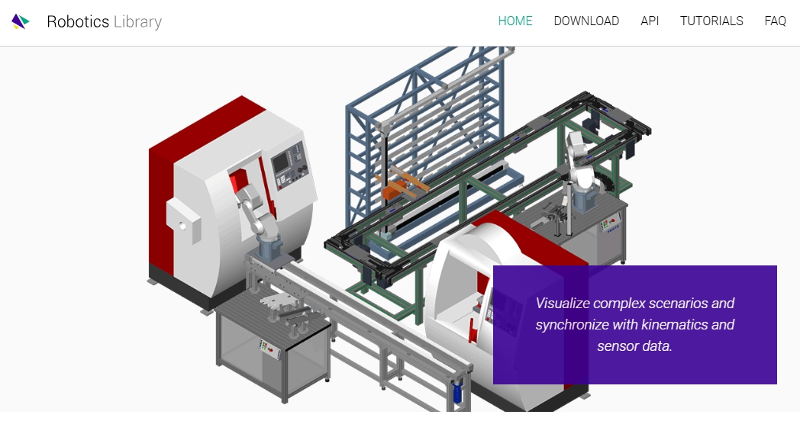

# 任务08：调研类——调研除了ROS以外的机器人操作系统（软件框架）有哪些，有何异同？

## Description:

- 调研类，需要输出报告以及汇总对比表格
- 尽可能地输出些自己的观点和看法
- 可以把能跑起来的系统（软件框架）自己跑一下体验体验效果
- 一些已经停止维护的项目简单贴一下名字和链接，不用费时间细看

## **Orocos**

### Orocos  (Open Robot Control Software)简介

Orocos是一个可移植的c++库，用于高级机器和机器人控制。

多年来，Orocos已经成为一个用于开发机器人软件的大型中间件和工具项目。该项目的主要部分是**实时工具链(RTT)和Orocos组件库(OCL)**。

Orocos Real-Time Toolkit (RTT):一个组件框架，允许我们用c++编写实时组件。

Orocos组件库(OCL):启动应用程序并在运行时与其交互所需的组件。

Orocos Log4cpp (Log4cpp): Log4cpp库的补丁版本，用于灵活地记录到文件，syslog, IDSA和其他目的地。

Orocos还开发了其他库来补充高级机器和机器人控制包。这些库包括运动链的计算、过滤和提前任务规范等。

运动学与动力学库(KDL):一个独立于应用程序的运动链建模和计算框架。

贝叶斯滤波库(Bayesian Filtering Library, BFL):动态贝叶斯网络中独立于应用的推理框架，即基于贝叶斯规则的递归信息处理和估计算法。

精简有限状态机(rFSM): Lua中一个小而强大的状态图实现。

使用约束的瞬时任务规范(iTaSC):是一个框架，通过指定机器人(部分)及其环境之间的约束来生成机器人运动。

Orocos框架很好地与ROS相融, ROS是机器人专家中最大的社区中设计新应用程序的流行软件包。这两个框架中的大多数概念都映射得很好，并且得到了很大程度的支持

官方文档连接：https://docs.orocos.org/

官方github仓库：https://github.com/orocos

### Orocos & ROS

|          | Orocos                                                   | ROS                                    |
| -------- | -------------------------------------------------------- | -------------------------------------- |
| 关注核心 | 机器人的实时控制                                         | 机器人通信和管理                       |
| 实时性   | 本地实时功能                                             | 有限的实时功能，ROS2在改进             |
| 贡献社区 | 更小、更专业的社区                                       | 拥有广泛支持的更大、更多样化的社区     |
| 生态系统 | 专注于实时的、特定于控制的工具                           | 广泛的生态系统，为各种应用程序提供工具 |
| 模块化   | 高度模块化，可以使用或不使用中间件                       | 模块化，但严重依赖其通信工具           |
| 应用场景 | 工业自动化机器人控制等搞实时性需求场景                   | 研究、教育、通用机器人                 |
| 库和工具 | Real-Time Toolkit, Kinematics and Dynamics Library (KDL) | 广泛的机器人相关软件包                 |

### 相关文献：

- [Open robot control software: the OROCOS project | IEEE Conference Publication | IEEE Xplore](https://ieeexplore.ieee.org/abstract/document/933002)
  - 本文介绍了OROCOS项目，该项目旨在成为一个通用的开放式机器人控制软件包。OROCOS遵循开源开发模型，该模型已被证明可以在许多其他通用软件包(如Linux、Apache、Perl或LATEX)中工作。本文着重于这个启动项目的长期愿景，激励采取哪些战略和创新的设计决策(类似CORBA的组件体系结构是最重要的一个)，并列出OROCOS可以构建的其他项目。OROCOS的成功关键取决于有多少研究人员和工程师能够被激励为项目贡献代码、文档和反馈。

- [Benchmarking Real-Time Capabilities of ROS 2 and OROCOS for Robotics Applications | IEEE Conference Publication | IEEE Xplore](https://ieeexplore.ieee.org/abstract/document/9561026)
  - 摘要：许多机器人和控制应用都有严格的实时要求，一旦违反，就会导致服务质量下降，或者在安全关键应用的情况下，甚至可能产生灾难性的后果。为了确保满足某些实时约束，机器人专家依赖于实时安全框架、环境和中间件。随着ROS 2的引入，以及PREEMPT_RT等内核补丁的引入，有大量的解决方案可供选择。本文在各种基准测试中比较了基于PREEMPT_RT和普通Linux内核的OROCOS和ROS 2，并得出了它们在实时关键应用程序中的性能结论。基准测试的结果显示了在正常条件下的类似性能。然而，当系统处于压力之下时，两个框架都会以不同的方式受到影响。此外，结果表明，随着时间的推移，累积误差违反了两个框架的实时性要求。这些发现对于进行具有实时限制的实际应用至关重要。
- [OROCOS-based generic control system for a 6 DOF industrial manipulator | IEEE Conference Publication | IEEE Xplore](https://ieeexplore.ieee.org/abstract/document/7736277)
  - 本文介绍了一种基于pc机的控制应用程序的设计和实现，该应用程序对现有的工业机械手进行了改造。该系统使用基于OROCOS组件的框架实现实时功能，并使用其基础架构实现软件组件交互。这与使用一些提供的库和内置开发工具一起允许快速开发方法。对基于PCI的I/O卡外围硬件的直接寻址被描述和提出，作为解决Linux中硬件I/O长期挑战的一种解决方案，这种挑战部分是由于缺乏对设备驱动程序的支持而引起的。结果是一个功能齐全的控制应用程序，提供标准的机械手功能以及机载分析工具和基于传感器的扩展功能的能力。此外，由此产生的方案基于商业上现成的通用硬件，因此可以完整地复制。

### 相关开源项目：

- [kuka-isir/rtt_lwr: OROCOS/ROS components for light weight robots at ISIR (github.com)](https://github.com/kuka-isir/rtt_lwr)

- [qqfly/baxter_kinematics_dynamics: Kinematics and dynamics library for Rethink Baxter, using orocos KDL. (github.com)](https://github.com/qqfly/baxter_kinematics_dynamics)

- [jhu-lcsr/rtt_gazebo: Gazebo plugins for running Orocos RTT components in the gazebo process. (github.com)](https://github.com/jhu-lcsr/rtt_gazebo)

## Webots

### Webots

Webots是cyberbots有限公司开发的一款应用广泛的机器人仿真软件。它提供了一个用于建模、编程和模拟移动机器人的开发环境。通过Webots，用户可以不需要物理机器人，仅仅在虚拟和受控的3D世界中设计复杂的机器人设置，对它们进行编程，模拟它们的行为，并可视化它们的操作。

**Webots：**

- 提供强大的3D建模组件，允许用户创建和操作环境和机器人模型。支持从CAD文件导入，简化了从设计到仿真的过渡。

- 使用ODE(开放动力学引擎)进行真实的物理模拟。这包括处理碰撞、摩擦和其他影响机器人的现实世界物理特性。

- 机器人可以使用多种编程语言进行编程，包括C、c++、Python和Java，提高了开发的便利程度。

- Webots提供了一套全面的模拟传感器和执行器，包括激光雷达、摄像头、触摸传感器、电机和GPS等。

- Webots允许用户创建不同的环境(城市环境、崎岖地形、室内场景)来测试不同条件下的机器人。

- 提供多种类的库提高了代码的可复用性，Webots的库支持社区共享，进一步缩短了开发周期。

- 能够和其他常用的工具和软件框架如ROS等兼容，进一步提高其功能，提高系统开发和测试的全面性

官网连接：https://cyberbotics.com/

官方github仓库：https://github.com/cyberbotics/webots

### Webots & ROS

Webots主要面向机器人的仿真，提供在虚拟环境中创建和测试机器人模型的工具，而ROS作为一种中间件，主要致力于管理真实系统中各种机器人组件的通信和操作

|          | Webots                                    | ROS                                          |
| -------- | ----------------------------------------- | -------------------------------------------- |
| 主要功能 | 机器人仿真软件                            | 用于机器人通信和管理的中间件                 |
| 关注核心 | 机器人模型和环境的仿真                    | 机器人通信和管理                             |
| 语言支持 | C, C++, Python, Java                      | C++, Python（其他语言需要第三方库的支撑）    |
| 兼容性   | 能够和其他常用的工具和软件框架如ROS等兼容 | 能够和其他常用的工具和软件框架如Webots等兼容 |
| 关键组件 | 三维建模，物理仿真，传感器仿真            | 组件之间的通信，包管理                       |
| 社区生态 | 相对较小，专注于机器人的仿真              | 拥有广泛支持的更大、更多样化的社区           |
| 拓展性   | 在仿真领域有高拓展性                      | 在各种机器人应用领域有高拓展性               |

### 相关文献：

- [Cyberbotics Ltd. Webots™: Professional Mobile Robot Simulation - Olivier Michel, 2004 (sagepub.com)](https://journals.sagepub.com/doi/full/10.5772/5618)
  - 摘要：cyberbots有限公司开发了Webots™，这是一款移动机器人仿真软件，为您提供了一个快速的原型环境，用于建模，编程和模拟移动机器人。提供的机器人库使您能够将您的控制程序转移到几个商业上可用的真实移动机器人。Webots™允许您定义和修改完整的移动机器人设置，甚至几个不同的机器人共享相同的环境。对于每个对象，您可以定义许多属性，例如形状、颜色、纹理、质量、摩擦等。您可以为每个机器人配备大量可用的传感器和执行器。您可以使用您喜欢的开发环境对这些机器人进行编程，模拟它们，并有选择地将生成的程序转移到您的真实机器人上。Webots™是与瑞士洛桑联邦理工学院合作开发的，经过全面测试，记录良好，并持续维护了7年以上。它现在是cyberbots有限公司的主要商业产品。

- [Performance evaluation of vehicular platoons using Webots - Karoui - 2017 - IET Intelligent Transport Systems - Wiley Online Library](https://ietresearch.onlinelibrary.wiley.com/doi/full/10.1049/iet-its.2017.0036)
  - 摘要：车辆排的安全问题仍然是一个严峻的挑战，仍有待进一步研究。在这项研究中，作者提出了一个精确的车辆排仿真模型，考虑了排的运动学和动力学方面及其物理约束。开发了一种由两种不同的纵向和横向比例-积分-导数控制器和两种运行模式同时组成的混合控制器，并利用Webots进行了仿真。通过本研究，旨在深入研究排的性能，揭示其在真实场景中的弱点。后者包括正常/降级操作模式，不同速度，全制动场景和各种全球定位系统精度。结果表明，即使在预定义的退化模式下，该排控制器也是有效的。
- [Deepbots: A Webots-Based Deep Reinforcement Learning Framework for Robotics | SpringerLink](https://link.springer.com/chapter/10.1007/978-3-030-49186-4_6)
  - 摘要：深度强化学习(DRL)越来越多地用于训练机器人执行复杂和精细的任务，而逼真模拟器的发展有助于加速机器人技术中深度强化学习的研究。然而，在典型的DRL管道中使用这样的模拟器仍然不是直截了当的，因为它们陡峭的学习曲线和与DRL方法接口所需的大量开发极大地限制了研究人员对它们的使用。为了克服这些限制，在这项工作中，我们提出了一个开源框架，将DRL研究人员使用的既定接口OpenAI Gym接口与最先进的Webots机器人模拟器相结合，以提供一种在各种机器人场景中使用DRL的标准化方法。Deepbots旨在通过处理所有底层细节并减少所需的开发工作量，使研究人员能够轻松地在Webots中开发DRL方法。所提出的框架的有效性通过代码示例以及使用三个不同难度的用例来证明。
- [SLAM (Simultaneous localisation and mapping) Using E-PUCK Robot In Webots Software | IEEE Conference Publication | IEEE Xplore](https://ieeexplore.ieee.org/abstract/document/10157295)
  - 摘要:本文提出了一个SLAM(同时定位和地图绘制)使用一个E-puck机器人在Webots软件。自主移动机器人领域最近引起了许多研究人员的兴趣。由于移动机器人系统的许多应用的独特要求，特别是在定位领域，机器人测绘和线路跟踪已经成为在陌生环境中指导机器人的支柱。本文为SLAM和占用网格构建地图提供了理论基础。本课题采用E-Puck机器人，并在Webots程序中使用Python进行仿真。本实验成功地对E-Puck机器人进行了编程和控制，实现了对未知区域的定位和测绘。为了解决SLAM中机器人姿态的不确定性和导航过程中的自定位问题，我们采用了扩展卡尔曼滤波(EKF)。测绘(占用网格)已经完成，机器人现在可以使用它在周围环境中旅行。通过仿真结果，我们证明了机器人系统可以找到自己，构建环境地图，并在环境中导航(遥操作)。
- [[2403.00765\] An Architecture for Unattended Containerized (Deep) Reinforcement Learning with Webots (arxiv.org)](https://arxiv.org/abs/2403.00765)
  - 摘要：随着数据科学应用程序在各行各业得到广泛采用，工具领域逐渐成熟，以促进此类应用程序的生命周期，并为所涉及的挑战提供解决方案，以提高相关人员的生产力。在3D世界中使用代理进行强化学习仍然面临挑战:使用仿真软件所需的知识，以及在无人值守的培训管道中使用独立仿真软件。
    在本文中，我们回顾了机器人Robotino在3D世界中训练机器人强化学习代理的工具和方法，并认为虚拟世界创造者的模拟环境和数据科学家的模型开发环境的分离不是一个很好的主题。通常两者是相同的，数据科学家需要模拟软件的知识来直接使用他们的api。此外，有时虚拟世界的创造者和数据科学家甚至在同一个文件上工作。我们希望通过描述一种数据科学家不需要模拟软件知识的方法来为这个主题做出贡献。我们的方法使用独立的仿真软件Webots，机器人操作系统与仿真机器人进行通信，以及仿真软件本身和容器技术，将仿真与模型开发环境分开。我们强调数据科学家使用的api，以及在无人值守培训管道中使用独立模拟软件。我们展示了Robotino特有的部分以及机器人的学习任务。

- [Developing Khepera robot applications in a Webots environment | IEEE Conference Publication | IEEE Xplore](https://ieeexplore.ieee.org/abstract/document/903293)
  - 摘要：Khepera是一个高性能的微型机器人。其紧凑的功率允许使用真实的机器人和应用基本的仿真工具进行有效的实验。Webots是一个高质量的Khepera模拟器，用于自主系统，智能机器人，进化机器人，机器学习，计算机视觉和人工智能领域。该仿真程序可以方便地移植到实际机器人上。本文的目的是支持在Webots环境中开发Khepera应用程序。本文从Khepera机器人的介绍及其开发方法入手，给出并分析了Khepera机器人在Webots环境中的应用实例。最后，对该技术的应用现状和未来的研究方向进行了展望。

### 相关开源项目：

- [lukicdarkoo/awesome-webots: Awesome Webots (github.com)](https://github.com/lukicdarkoo/awesome-webots)

- [aidudezzz/deepbots: A wrapper framework for Reinforcement Learning in the Webots robot simulator using Python 3. (github.com)](https://github.com/aidudezzz/deepbots)
- [robocup-junior/rcj-soccersim: The RoboCupJunior Soccer Simulator, based on Webots (github.com)](https://github.com/robocup-junior/rcj-soccersim)
- [JackyMao1999/webots_demo: ROS联合webots实战案例 (github.com)](https://github.com/JackyMao1999/webots_demo)

## YARP 

### **YARP(Yet Another Robot Platform)**:

YARP (Yet Another Robot Platform)是一个为机器人研究开发软件应用程序而设计的软件库和工具包。如果数据是的机器人的血液，那么YARP就是循环系统。

YARP (Yet Another Robot Platform)是一个复杂的中间件，专门用于促进机器人软件系统的开发和管理。它允许创建模块化机器人控制系统，其中组件，如传感器和执行器，以点对点的方式进行通信。

**核心特色和理念**

- 支持将机器人系统构建为彼此直接通信的单个程序(或节点)的集合。促进了模块化，使开发、测试和维护复杂系统变得更加容易。
- 支持广泛的通信协议，包括TCP、UDP、多播等。允许用户定制通信方法，以适应特定的项目需求和条件，提高系统的效率和有效性。
- YARP在硬件设备上提供了一个抽象层，使开发人员能够与各种硬件进行交互，而无需绑定到特定的设备驱动程序或模型。此特性简化了硬件升级和集成，因为硬件的更改只需要对高级应用程序代码进行最小的调整。
- YARP的设计目的是在现有的操作系统之上工作，而不是取代它们。它可以跨不同的系统运行，增加了它的多功能性和广泛的适用性。
- 该平台包括通信通道优先级的机制，称为通道优先级。此特性对于性能关键型应用程序至关重要，可以减少延迟并提高系统组件之间通信的确定性。
- YARP旨在通过强调适应性和前向兼容性来延长机器人软件的功能寿命。

官方网站：https://www.yarp.it/latest//

官方仓库：https://github.com/robotology/yarp

### YARP & ROS

YARP特别适用于需要强大实时能力和高度模块化架构的项目。它允许在使用的通信协议方面具有显著的灵活性，以满足复杂机器人系统的特定需求。另一方面，ROS专注于为各种类型的机器人应用程序提供一个全面的框架，通过庞大的工具和库生态系统，简化机器人软件的管理和部署。

|              | YARP                                                       | ROS                                       |
| ------------ | ---------------------------------------------------------- | ----------------------------------------- |
| 主要目标     | 模块化机器人开发的中间件                                   | 机器人软件管理中间件                      |
| 设计理念     | 强调模块化和实时功能                                       | 强调组件的可拓展性和可重用性              |
| 通信方式     | 基于多种协议的点对点通信                                   | 发布者-订阅者和服务-客户端模型            |
| 实时性       | 对实时性有较高支持度                                       | 有限的实时功能，ROS2在改进                |
| 编程语言     | 主要是C++                                                  | C++, Python（其他语言需要第三方库的支撑） |
| 硬件抽象程度 | 高度抽象，突出设备独立性                                   | 高，广泛支持各种硬件                      |
| 社区生态     | 规模较小，但却专注于特定的先进研究领域，特别是人形机器人。 | 更大、更多样化的社区，有大量可用的包      |

### 相关文献：

- [[2310.01039\] Software Reconfiguration in Robotics (arxiv.org)](https://arxiv.org/abs/2310.01039)

  摘要：由于学术界经常声称重构是必不可少的，因此已经开发了许多重构方法，特别是机器人系统的重构方法。因此，关于机器人的文献中有丰富的重新配置机器人系统的技术。然而，当与该领域的研究人员交谈时，对于重构究竟是什么以及它与适应等其他概念的关系，似乎没有共同的理解。除了这个学术视角之外，机器人框架还提供了动态加载和卸载机器人应用程序部分的机制。虽然我们从学术角度对机器人重新配置的最新技术有一个模糊的了解，但我们缺乏从从业者角度对实践状态的了解。为了填补这一空白，我们通过识别和分析98篇相关论文来调查机器人系统中重构的文献，回顾了四种主要的机器人框架如何支持重构，最后研究了48种机器人应用中重构的实现。对比研究结果和实际情况，我们发现两者之间存在显著差异，特别是科学界关注的是复杂结构重构，而实际中广泛应用的只是参数重构。根据我们的观察，我们讨论了这种差异的可能原因，并为对机器人感兴趣的学者和从业者提供了一条重要信息。

### 相关开源项目：

- [robotology-legacy/yarp-wholebodyinterface: Implementation of the wholeBodyInterface for YARP robots. (github.com)](https://github.com/robotology-legacy/yarp-wholebodyinterface)

- [robotology-playground/GYM: The Generic Yarp Module is a component model to easily develop software modules for robotics leveraging the YARP ecosystem (github.com)](https://github.com/robotology-playground/GYM)

- [diegoferigo/gazebo-yarp-synchronizer: Synchronization with Gazebo Classic via YARP. With Python batteries. (github.com)](https://github.com/diegoferigo/gazebo-yarp-synchronizer)

- [vvv-school/tutorial_yarp-basics: This tutorial shows some of the basic features of YARP, usually required when dealing with a robot (github.com)](https://github.com/vvv-school/tutorial_yarp-basics)

- [wrousseau/yarp-to-ros-bridge: A bridge generator which will allow the communication between YARP and ROS robotics middleware, simply using a user defined configuration file. (github.com)](https://github.com/wrousseau/yarp-to-ros-bridge)

- [modular-ml/wrapyfi: Python Wrapper for Message-Oriented and Robotics Middleware (github.com)](https://github.com/modular-ml/wrapyfi)

## RL

### Robotics Library (RL)

机器人库(RL)是一个独立的c++库，用于机器人运动学，运动规划和控制。它涵盖了数学、运动学和动力学、硬件抽象、运动规划、碰撞检测和可视化。

**Robotics Library的重要特性**

- 为解决与机器人的运动和机械行为相关的问题提供了详细的算法，在处理机器人手臂方面有很大优势。
- RL包括多个运动规划算法，有助于规划机器人执行任务的可行路径，避免发生碰撞。
- RL提供用于几何计算的应用程序，便于机器人对环境中的几何对象进行处理。
- RL独立于任何特定的机器人硬件或中间件，具有高度的通用性，并适应各种机器人平台和应用程序。

官方网站：https://www.roboticslibrary.org/

官方仓库：https://github.com/roboticslibrary/rl

### RL & ROS

RL专门用于运动规划和运动学，适合需要详细模拟和计算机器人运动的学术和研究环境。ROS作为一个全面的框架，不仅促进了运动规划，还促进了通信、传感器集成和各种其他机器人功能。

RL更多地关注算法方面，而不是直接的硬件集成。另一方面，ROS提供了健壮的硬件抽象层，允许与广泛的机器人硬件轻松集成。

|          | Robotics Library (RL)                            | ROS                                       |
| -------- | ------------------------------------------------ | ----------------------------------------- |
| 框架定位 | 运动学，动力学和运动规划库                       | 机器人软件管理中间件                      |
| 专注领域 | 专注于机器人运动的算法                           | 专注于管理复杂的机器人应用                |
| 核心功能 | 运动学，动力学，运动规划                         | 组件之间的通信，工具管理                  |
| 语言支持 | C++                                              | C++, Python（其他语言需要第三方库的支撑） |
| 硬件抽象 | 有限，更偏向于算法开发                           | 支持多重硬件设备                          |
| 兼容性   | 可以集成到更大的系统中，但不能直接集成到中间件中 | 能够与多种机器人软件和硬件相兼容          |
| 社区生态 | 更小，专注于特定的技术领域                       | 更大、更多样化的社区                      |

### 相关文献：

- [Robotics library: An object-oriented approach to robot applications | IEEE Conference Publication | IEEE Xplore](https://ieeexplore.ieee.org/abstract/document/8202232)

  摘要：我们讨论了Robotics Library (RL)的架构和软件工程原理。在机器人系统、研究项目、工业应用和教育需求的驱动下，我们确定了相关的设计需求，并提出了一种管理硬件和实时的方法，为强大的运动学和动力学计算提供了一个用户友好的、面向对象的界面，并支持各种平台。从2004年开始，经过十多年的开发，并评估了该体系结构的许多变体，我们讨论了当前版本中库组件的设计选择

- [Efficient Grasp Detection Network With Gaussian-Based Grasp Representation for Robotic Manipulation | IEEE Journals & Magazine | IEEE Xplore](https://ieeexplore.ieee.org/document/9990918/figures#figures)

- 摘要：深度学习方法在抓握检测领域取得了优异的成绩。然而，基于深度学习的通用目标检测模型缺乏准确性和推理速度的适当平衡，导致在实时抓取任务中的性能不佳。本文提出了一种以n通道图像作为机器人抓取输入的高效抓取检测网络。所提出的网络是一种轻量级的生成结构，用于单阶段抓握检测。具体而言，引入基于高斯核的抓取表示对训练样本进行编码，体现具有最高抓取置信度的最大中心。在瓶颈中插入一个接受域块，以提高模型的特征可分辨性。此外，采用基于像素和基于通道的注意机制，通过抑制噪声特征和突出目标特征来构建多维注意融合网络，融合有价值的语义信息。在Cornell, Jacquard和扩展的ocd抓取数据集上对该方法进行了评估。实验结果表明，该方法具有良好的平衡精度和运行速度性能。该网络的运行速度为6ms，在Cornell、Jacquard和extended ocd抓取数据集上获得了更好的性能，准确率分别为97.8、95.6和76.4%。随后，UR5机械臂在物理环境中获得了优异的抓取成功率。

- [A novel framework to improve motion planning of robotic systems through semantic knowledge-based reasoning - ScienceDirect](https://www.sciencedirect.com/science/article/pii/S0360835223003698)

  摘要：改进机械臂机器人的运动规划技术和新的有效策略来操纵不同的物体来执行更复杂的任务，对于机器人与人类合作的各种实际应用至关重要。本文提出了一种新的框架，旨在通过基于语义知识的推理来改进机器人智能体(机械手机器人)的运动规划。使用语义Web规则语言(SWRL)基于已知环境和机器人系统来推断新知识。本体知识，例如语义地图，是通过深度神经网络生成的，经过训练可以在机器人代理执行的环境中检测和分类物体。推导了操作约束条件，并创建了与智能体操作工作空间相对应的环境，使规划器能够对其进行解释，从而生成无碰撞路径。为了对本体进行推理，使用了不同的SPARQL查询。所提出的框架在一个真实的实验设置中实现和验证，使用规划框架ROSPlan来执行规划任务。所提出的框架被证明是一种很有前途的策略，可以改善机器人系统的运动规划，显示人工智能在机器人知识表示和推理方面的优势。

### 相关开源项目：

- [roboticslibrary/nlopt: library for nonlinear optimization, wrapping many algorithms for global and local, constrained or unconstrained, optimization (github.com)](https://github.com/roboticslibrary/nlopt)
- [roboticslibrary/bullet3: Bullet Physics SDK: real-time collision detection and multi-physics simulation for VR, games, visual effects, robotics, machine learning etc. (github.com)](https://github.com/roboticslibrary/bullet3)
- [roboticslibrary/libiconv: GNU libiconv (github.com)](https://github.com/roboticslibrary/libiconv)

## MRPT (Mobile Robot Programming Toolkit)

MRPT提供了针对移动机器人和计算机视觉研究人员的c++库。库包括SLAM解决方案、2D和3D空间变换、SE(2)/SE(3)李群、点、地标、姿态和地图的概率密度函数(pdf)、贝叶斯推理(卡尔曼滤波器、粒子滤波器)、图像处理、避障等。MRPT还提供用于相机校准，数据集检查等的GUI应用程序。

### **MRPT的功能**

- **定位和绘图:**
  - MRPT涵盖在2D和3D环境中同时定位和绘图的算法。
  - 支持多种SLAM方法，如扩展卡尔曼滤波、粒子滤波(蒙特卡罗定位)和基于图的优化方法。
- **传感器处理:**
  - 该工具包可以处理来自机器人中常用的各种传感器的数据，包括激光雷达、RGB-D相机和惯性测量单元(imu)。
- **导航:**
  - MRPT提供了路径规划和避障工具，允许机器人安全地在复杂的环境中导航。
- **可视化工具:**
  - 它配备了一系列可视化功能，以帮助调试和分析机器人的行为。这包括实时3D可视化和绘制传感器数据的工具。
- **跨平台兼容:**
  - MRPT主要用c++编写，可以运行在Windows、Linux和其他支持c++的操作系统上。
- **模块化结构:**
  - 该库被组织成更小的模块，从而更容易将特定功能集成到各种应用程序中，而无需处理整个工具包。

### MRPT的应用

- 学术研究:
  - 在机器人研究中用于实验不同的算法和策略。
- 商业机器人应用:
  - 可用于开发商业机器人解决方案，如自动驾驶汽车或无人机。
- 业余爱好者项目:
  - 的开源性质和全面的文档使对机器人感兴趣的业余爱好者可以访问它。

MRPT目前仍在不断更新，并得到开发人员社区的支持

- github仓库：https://github.com/MRPT/mrpt.git

### 相关文献：

- [(PDF) Development of Scientific Applications with the Mobile Robot Programming Toolkit (researchgate.net)](https://www.researchgate.net/publication/242589410_Development_of_Scientific_Applications_with_the_Mobile_Robot_Programming_Toolkit)

- [Actuators | Free Full-Text | Development of the Anthropomorphic Arm for Collaborative and Home Service Robot CHARMIE (mdpi.com)](https://www.mdpi.com/2076-0825/13/7/239)

  摘要：服务机器人正迅速从概念向现实转变，取得了长足的发展。同样，假肢领域也在以令人印象深刻的速度发展，这两个领域现在都与行业高度相关。这些领域的进步不断推动着可能性的界限，导致越来越多的个体手臂和手部假肢的创造，无论是作为独立的单元还是组合的包装。这种趋势是由先进的协作机器人的兴起推动的，这些机器人在现实世界的应用中与人类同行无缝集成。本文介绍了一种开源的3d打印机械臂，它使用两种不同的方法进行组装和编程。第一种方法包括通过远程操作控制手，利用相机和基于机器学习的手部姿势估计。该方法详细介绍了从摄像机捕获数据并将其转换为硬件信号所需的编程技术和过程。第二种方法采用运动学控制，使用denavit - hartenberg方法来定义运动并确定末端执行器在3D空间中的位置。此外，本工作还讨论了对手臂和手的组装和修改，以创建一个具有成本效益和实用的解决方案。通常，实施远程操作需要大量的传感器和摄像头，以确保顺利和成功的操作。本文探讨了人工智能(AI)实现的方法，这些方法减少了对广泛的传感器阵列和设备的需求。它研究了人工智能生成的数据如何转化为各个领域的有形硬件应用。计算机视觉的进步，加上能够准确预测姿势的人工智能，有可能彻底改变我们控制和与周围世界互动的方式。

- [Design of Dual-LiDAR High Precision Natural Navigation System | IEEE Journals & Magazine | IEEE Xplore](https://ieeexplore.ieee.org/abstract/document/9720994)

  摘要：随着网络购物的进一步发展和新冠疫情的影响，物流行业对无人驾驶、自动化仓储和物流处理的需求进一步增加。要实现智能仓储和物流搬运，可靠的定位导航技术必不可少。因此，本文设计了一种基于ROS (Robot Operating system，机器人操作系统)平台的双激光雷达高精度自然导航系统，能够满足基本的仓储物流需求。自然导航系统采用基于图形优化的Lidar-SLAM方法构建二维环境地图，采用MRPT (Mobile Robot Programming Toolkit)中的PF (Particle Filter)算法进行系统定位，采用实时校正算法进行运动控制。在搭建的硬件平台上，导航系统完成了定点巡航导航任务，最终实现了4 cm的导航精度和6 mm的平均可重复导航精度。所设计的导航系统对多传感器融合导航具有参考意义。在现实中，它可以应用于仓储和物流的运输，并有望在未来大量生产。

- [OpenBeam: Off-Line and On-Line Tools to Solve Static Analysis of Mechanical Structures | SpringerLink](https://link.springer.com/chapter/10.1007/978-3-031-38563-6_9)

  摘要：结构静力计算的直接刚度矩阵法是最精确、最有效的方法之一，可用于分析最典型的建筑结构。目前的工作旨在填补与上述矩阵方法相关的计算力学领域的开源软件的空白，提供一个c++编程库和一组相关工具，使结构分析的方法变得简单。这个名为OpenBeam的新项目提出了一种强调教学应用程序的设计，其中包括:结构的简单参数化，图表的呈现以及变形结构的动画创建。此外，该软件的交互式版本是免费提供的在线工具，可在任何桌面或移动设备上使用，无需安装，因为它直接在web浏览器上运行。该应用程序可从https://open-beam.github.io/openbeam/访问。

### 相关开源项目：

- [gamman/MRPT: The Mobile Robot Programming Toolkit provides C++ developers an extensive, portable and well-tested set of libraries and applications which cover the most common data structures and algorithms employed in a number of mobile robotics research areas: localization, Simultaneous Localization and Mapping (SLAM), computer vision and motion planning (obstacle avoidance). (github.com)](https://github.com/gamman/MRPT)
- [mrpt-ros-pkg/mrpt_navigation: ROS 2 nodes wrapping core MRPT functionality: localization, autonomous navigation, rawlogs, etc. SLAM is in other packages. (github.com)](https://github.com/mrpt-ros-pkg/mrpt_navigation)
- [mrpt-ros-pkg/mrpt_slam: ROS wrappers for SLAM algorithms in MRPT (github.com)](https://github.com/mrpt-ros-pkg/mrpt_slam)
- [albertkasdorf/ro_slam_with_uwb: Range Only SLAM with Ultra Wideband (github.com)](https://github.com/albertkasdorf/ro_slam_with_uwb)

- [mrpt-ros-pkg/pose_cov_ops: ROS library for spatial transformations with uncertainty (MRPT wrapper) (github.com)](https://github.com/mrpt-ros-pkg/pose_cov_ops)

## DORA

### DORA

dora-rs是一个现代机器人框架，旨在简化机器人系统的开发和操作。它利用共享内存服务器和Apache Arrow进行高效、零拷贝的数据传输，从而提高了性能。该框架支持多种编程语言，包括Python、Rust和C/ c++，并且在构建时考虑了可伸缩性和社区参与。Dora-rs旨在促进快速原型和广泛的平台兼容性，使其成为机器人领域开发人员的通用工具。

**dora-rs的特性：**

- 在共享内存上传输零副本的信息，使用Arrow和dora提供的共享内存守护进程，以便在一台机器上进行光速通信。
- 支持跨平台拓展，使用YAML描述进行软件声明，以便在不同平台上进行部署。
- 使用 YAML 数据流中现成的节点，不必费心复制粘贴模板代码了。支持使用 Python 进行实时修补。
- 支持通过dora-rs提供的 cli 和 opentelemetry 获取日志、跟踪和指标。
- dora支持Python、Rust、C 和 C++ 语言，能够在大多数平台和架构上运行

### DORA & ROS

dora-rs 通过 Apache Arrow 的零拷贝传输实现高效的数据处理，这在对于要求高数据吞吐量和最小延迟的应用中非常有利，且支持以性能和安全特性著称的 Rust 以及 Python 和 C/C++。而ROS 拥有一个庞大而成熟的社区，提供丰富的资源和文档，是目前许多机器人开发人员的首选。

|          | dora-rs                              | ROS                          |
| -------- | ------------------------------------ | ---------------------------- |
| 核心焦点 | 现代机器人框架                       | 机器人系统的中间件           |
| 数据处理 | 使用 Apache Arrow 进行零拷贝数据传输 | 标准通信协议                 |
| 语言支持 | Python, Rust, C/C++                  | C++, Python                  |
| 性能表现 | 通用、灵活                           | 通过共享内存服务器优化高性能 |
| 可扩展性 | 可扩展性强，适用于各种环境           | 专为可扩展性和快速原型设计   |

## Reference

1. [Hello from dora-rs | dora-rs](https://dora-rs.ai/)

2. [Robotics Library](https://www.roboticslibrary.org/)

3. [YARP: Welcome to YARP](https://www.yarp.it/latest//)
4. [常见机器人框架(ROS、OpenRTM、YARP、Orocos、CARMEN、MOOS）简介-CSDN博客](https://blog.csdn.net/czsnooker/article/details/121250017)

5. [Top 5 Free and Open Source Robotics Frameworks (medevel.com)](https://medevel.com/top-5-free-and-open-source-robotics-frameworks/)
