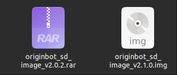

# Origin Robot Test

## **部件组装**

组装流程：http://originbot.org/guide/hardware_setup/

## **镜像与固件烧录**

**SD卡镜像烧录**

- 安装 `balenaEtcher`

  ```
  weget -c https://github.com/balena-io/etcher/releases/download/v1.19.25/balena-etcher_1.19.25_amd64.deb
  sudo apt install ./balena-etcher_1.19.25_amd64.deb
  ```

+ 下载并解压对应镜像：
  

  

  用 `balenaEther` 将对应镜像烧录入SD卡中即可
  
  
  

**控制板固件烧录**

+ 下载 `flymcu.exe`

  https://gitee.com/guyuehome/originbot_controller/blob/master/tools/FlyMcu.exe

+ 下载对应控制固件：

  https://pan.baidu.com/s/1qMlekq84JQBM8OZC3pm0rA?pwd=gyh1

+ 烧录配置：

  http://originbot.org/guide/firmware_install/#download_controller_firmware

## 基本功能测试

**底盘启动测试**

```
ros2 launch originbot_bringup originbot.launch.py
```

**相机驱动测试**

```bash
cd /userdata/dev_ws
ros2 launch originbot_bringup mipi_camera_websoket_display.launch.py
```


**雷达驱动**

+ 机器人端：

  ```bash
  ros2 launch originbot_bringup originbot.launch.py use_lidar:=true
  ```

  


+ 上位机：

  ```
  ros2 launch originbot_viz display_lidar.launch.py
  ```

  

**`IMU`驱动**

+ 机器人端：

  ```
  ros2 launch originbot_bringup originbot.launch.py use_imu:=true
  ```

  


+ 上位机：

  ```
  ros2 launch originbot_viz display_imu.launch.py
  ```

  

**地图构建**

+ 机器人端：

  ```
  ros2 launch originbot_bringup originbot.launch.py use_lidar:=true use_imu:=true
  ```

  

  ```
  ros2 launch originbot_navigation cartographer.launch.py
  ```

  

+ 上位机：

  ```
  ros2 launch originbot_viz display_slam.launch.py
  ```

  

  ```
  ros2 run teleop_twist_keyboard teleop_twist_keyboard
  ```

  可通过键盘控制轮子转动

+ 机器人端：

  ```
  cd /userdata/dev_ws/src/originbot/originbot_navigation/maps
  ros2 run nav2_map_server map_saver_cli -f my_map --ros-args -p save_map_timeout:=10000.0
  ```


**自主导航**

+ 机器人端：

  ```
  $ cd /userdata/dev_ws/
  $ colcon build --symlink-install --packages-select originbot_navigation
  ```

  ```
  ros2 launch originbot_bringup originbot.launch.py use_lidar:=true use_imu:=true
  ```

  ```
  ros2 launch originbot_navigation nav_bringup.launch.py
  ```

  

   map frame 缺失

+ 上位机：

  ```
  ros2 launch originbot_viz display_navigation.launch.py
  ```

  


