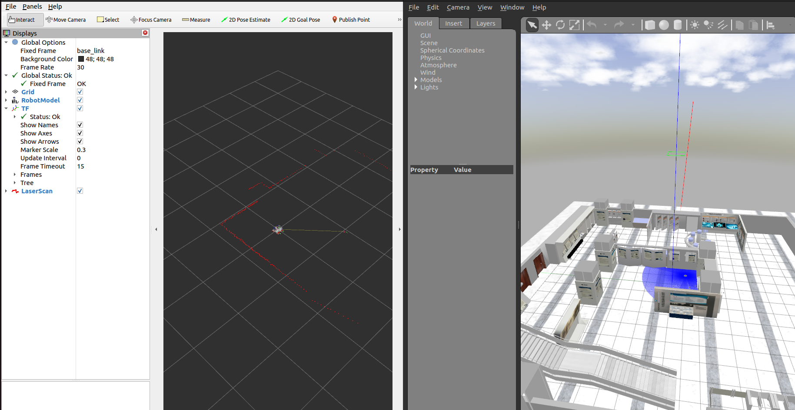

# ISCAS Map Adjusting



1. Export the `GAZEBO_MODEL_PATH`

   ```bash
   export GAZEBO_MODEL_PATH=<path to /ISCAS_ENV/models>:$GAZEBO_MODEL_PATH
   ```

2. launch display with specified world:

   ```bash
   ros2 launch robot_description robot_display_launch.py world:=.path to ROS-Academy.world 
   ```

3. launch slam_mapping with specified world:\

   ```bash
   ros2 launch robot_slam slam_mapping_launch.py world:=.path to ROS-Academy.world 
   ```

   