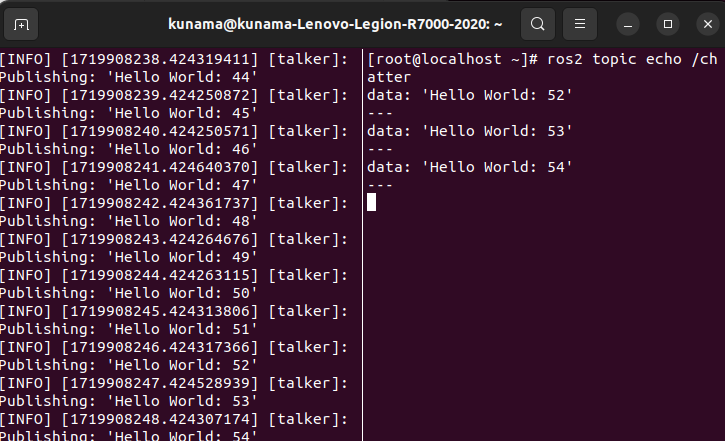
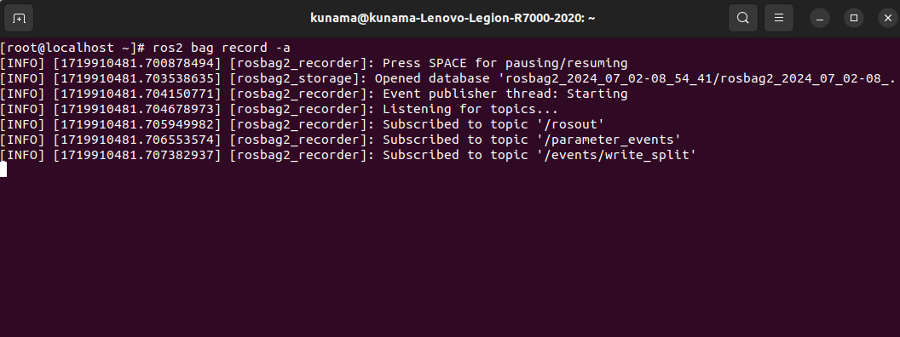

# ROS2工具测试

## X86 架构

### **turtlesim（需要安装图像化桌面）:**

在桌面启动两个终端（交互需求），在两个终端中分别输入：

```bash
ros2 run turtlesim turtlesim_node
```

以及：

```bash
ros2 run turtlesim turtle_teleop_key
```

在输入`ros2 run turtlesim turtle_teleop_key`的窗口下，根据提示，通过按键控制乌龟的移动即可：


### **ros2 pkg**

- ros2 pkg create

  执行 `ros2 pkg create riscv-ros-pkg`，输出如下，且当前目录存在相应文件夹，测试通过

  

- ros2 pkg executables

  执行 `ros2 pkg executables turtlesim`，输出如下，测试通过

  

- ros2 pkg list

  执行 `ros2 pkg list`，输出如下，测试通过

  

- ros2 pkg prefix

  执行 `ros2 pkg prefix turtlesim`，输出如下，测试通过

  

- ros2 pkg xml

  执行 `ros2 pkg xml turtlesim`，输出如下，测试通过

  

### ros2 run

执行 `ros2 run demo_nodes_cpp talker`，输出如下，测试通过


### ros2 topic

- ros2 topic list

  执行  `ros2 topic list`，输出如下，测试通过

  

- ros2 topic info

  执行 `ros2  topic info /rosout`，输出如下，测试通过

  

- ros2 topic type

  执行 `ros2 topic type /rosout`，输出如下，测试通过

  

- ros2 topic find

  执行 `ros2 topic find rcl_interfaces/msg/Log`，输出如下， 测试通过

  

- ros2 topic hz

  启动tmux（需要单独下载）分窗，在两个窗口分别执行命令 `ros2 run demo_nodes_cpp talker`，`ros2 topic hz /chatter`，输出如下，测试通过

  

- ros2 topic bw

  启动tmux（需要单独下载）分窗，在两个窗口分别执行命令 `ros2 run demo_nodes_cpp talker`，`ros2 topic bw /chatter`，输出如下，测试通过

  

- ros2 topic echo

  启动tmux（需要单独下载）分窗，在两个窗口分别执行命令 `ros2 run demo_nodes_cpp talker`，`ros2 topic echo /chatter`，输出如下，测试通过

  

- ros2 topic pub

  启动tmux（需要单独下载）分窗，在两个窗口分别执行命令分别执行命令 `ros2 topic pub -r 1 /chatter std_msgs/msg/String "data: Hello X86"`，`ros2 run demo_nodes_cpp listener`，输出如下，测试通过

  

### ros2 param

启动tmux（需要单独下载）分窗，在两个窗口分别执行命令 `ros2 run demo_nodes_cpp talker`, `ros2 param list`，输出如下，测试通过


### ros2 service

启动tmux（需要单独下载）分窗，在两个窗口分别执行命令 `ros2 run demo_nodes_cpp talker`, `ros2 service list`，输出如下，测试通过


### ros2 node 工具

- ros2 node list

  启动tmux（需要单独下载）分窗，在两个窗口分别执行命令`ros2 run demo_nodes_cpp talker`, `ros2 node list`，输出如下，测试通过

  

- ros2 node info

  启动tmux（需要单独下载）分窗，在两个窗口分别执行命令

  

### ros2 bag 

输入 `ros2 bag record -a`, 输出如下



### ros2 launch 工具

输入 `ros2 launch demo_nodes_cpp talker_listener.launch.py`，输出如下，测试通过


### ros2 interface 

- ros2 interface list

  执行 `ros2 interface list` ，输出如下，测试通过

  

- ros2 interface package

  执行 `ros2 interface package action_msgs` ，输出如下，测试通过

  

- ros2 interface packages

  执行 `ros2 interface packages` 输出如下，测试通过

  

- ros2 interface show

  执行 `ros2 interface show geometry_msgs/msg/TwistStamped` ，输出如下，测试通过

  

  执行 `ros2 interface show action_msgs/srv/CancelGoal` ，输出如下，测试通过

  

  执行 `ros2 interface show action_tutorials_interfaces/action/Fibonacci` ，输出如下，测试通过

  

- ros2 interface proto

  执行 `ros2 interface proto geometry_msgs/msg/TwistStamped` ，输出如下，测试通过

  


## 参考

https://gitee.com/yunxiangluo/open-euler-risc-v-ros2-humble/blob/master/QEMU/README.md#3-ros2-topic-%E5%B7%A5%E5%85%B7
