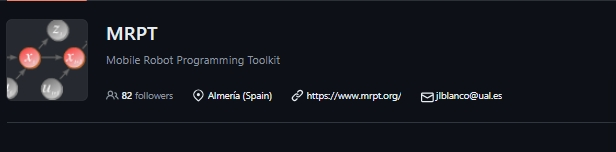

# 任务08：调研类——调研除了ROS以外的机器人操作系统（软件框架）有哪些，有何异同？

## Description:

- 调研类，需要输出报告以及汇总对比表格
- 尽可能地输出些自己的观点和看法
- 可以把能跑起来的系统（软件框架）自己跑一下体验体验效果
- 一些已经停止维护的项目简单贴一下名字和链接，不用费时间细看

## **Orocos**

### Orocos  (Open Robot Control Software)简介

Orocos是一个可移植的c++库，用于高级机器和机器人控制。

多年来，Orocos已经成为一个用于开发机器人软件的大型中间件和工具项目。该项目的主要部分是**实时工具链(RTT)和Orocos组件库(OCL)**。

Orocos Real-Time Toolkit (RTT):一个组件框架，允许我们用c++编写实时组件。

Orocos组件库(OCL):启动应用程序并在运行时与其交互所需的组件。

Orocos Log4cpp (Log4cpp): Log4cpp库的补丁版本，用于灵活地记录到文件，syslog, IDSA和其他目的地。

Orocos还开发了其他库来补充高级机器和机器人控制包。这些库包括运动链的计算、过滤和提前任务规范等。

运动学与动力学库(KDL):一个独立于应用程序的运动链建模和计算框架。

贝叶斯滤波库(Bayesian Filtering Library, BFL):动态贝叶斯网络中独立于应用的推理框架，即基于贝叶斯规则的递归信息处理和估计算法。

精简有限状态机(rFSM): Lua中一个小而强大的状态图实现。

使用约束的瞬时任务规范(iTaSC):是一个框架，通过指定机器人(部分)及其环境之间的约束来生成机器人运动。

Orocos框架很好地与ROS相融, ROS是机器人专家中最大的社区中设计新应用程序的流行软件包。这两个框架中的大多数概念都映射得很好，并且得到了很大程度的支持

官方文档连接：https://docs.orocos.org/

官方github仓库：https://github.com/orocos

### Orocos & ROS

|          | Orocos                                                   | ROS                                    |
| -------- | -------------------------------------------------------- | -------------------------------------- |
| 关注核心 | 机器人的实时控制                                         | 机器人通信和管理                       |
| 实时性   | 本地实时功能                                             | 有限的实时功能，ROS2在改进             |
| 贡献社区 | 更小、更专业的社区                                       | 拥有广泛支持的更大、更多样化的社区     |
| 生态系统 | 专注于实时的、特定于控制的工具                           | 广泛的生态系统，为各种应用程序提供工具 |
| 模块化   | 高度模块化，可以使用或不使用中间件                       | 模块化，但严重依赖其通信工具           |
| 应用场景 | 工业自动化机器人控制等搞实时性需求场景                   | 研究、教育、通用机器人                 |
| 库和工具 | Real-Time Toolkit, Kinematics and Dynamics Library (KDL) | 广泛的机器人相关软件包                 |

## Webots

### Webots

Webots是cyberbots有限公司开发的一款应用广泛的机器人仿真软件。它提供了一个用于建模、编程和模拟移动机器人的开发环境。通过Webots，用户可以不需要物理机器人，仅仅在虚拟和受控的3D世界中设计复杂的机器人设置，对它们进行编程，模拟它们的行为，并可视化它们的操作。

**Webots：**

- 提供强大的3D建模组件，允许用户创建和操作环境和机器人模型。支持从CAD文件导入，简化了从设计到仿真的过渡。

- 使用ODE(开放动力学引擎)进行真实的物理模拟。这包括处理碰撞、摩擦和其他影响机器人的现实世界物理特性。

- 机器人可以使用多种编程语言进行编程，包括C、c++、Python和Java，提高了开发的便利程度。

- Webots提供了一套全面的模拟传感器和执行器，包括激光雷达、摄像头、触摸传感器、电机和GPS等。

- Webots允许用户创建不同的环境(城市环境、崎岖地形、室内场景)来测试不同条件下的机器人。

- 提供多种类的库提高了代码的可复用性，Webots的库支持社区共享，进一步缩短了开发周期。

- 能够和其他常用的工具和软件框架如ROS等兼容，进一步提高其功能，提高系统开发和测试的全面性

官网连接：https://cyberbotics.com/

官方github仓库：https://github.com/cyberbotics/webots

### Webots & ROS

Webots主要面向机器人的仿真，提供在虚拟环境中创建和测试机器人模型的工具，而ROS作为一种中间件，主要致力于管理真实系统中各种机器人组件的通信和操作

|          | Webots                                    | ROS                                          |
| -------- | ----------------------------------------- | -------------------------------------------- |
| 主要功能 | 机器人仿真软件                            | 用于机器人通信和管理的中间件                 |
| 关注核心 | 机器人模型和环境的仿真                    | 机器人通信和管理                             |
| 语言支持 | C, C++, Python, Java                      | C++, Python（其他语言需要第三方库的支撑）    |
| 兼容性   | 能够和其他常用的工具和软件框架如ROS等兼容 | 能够和其他常用的工具和软件框架如Webots等兼容 |
| 关键组件 | 三维建模，物理仿真，传感器仿真            | 组件之间的通信，包管理                       |
| 社区生态 | 相对较小，专注于机器人的仿真              | 拥有广泛支持的更大、更多样化的社区           |
| 拓展性   | 在仿真领域有高拓展性                      | 在各种机器人应用领域有高拓展性               |

## YARP 

### **YARP(Yet Another Robot Platform)**:

YARP (Yet Another Robot Platform)是一个为机器人研究开发软件应用程序而设计的软件库和工具包。如果数据是的机器人的血液，那么YARP就是循环系统。

YARP (Yet Another Robot Platform)是一个复杂的中间件，专门用于促进机器人软件系统的开发和管理。它允许创建模块化机器人控制系统，其中组件，如传感器和执行器，以点对点的方式进行通信。

**核心特色和理念**

- 支持将机器人系统构建为彼此直接通信的单个程序(或节点)的集合。促进了模块化，使开发、测试和维护复杂系统变得更加容易。
- 支持广泛的通信协议，包括TCP、UDP、多播等。允许用户定制通信方法，以适应特定的项目需求和条件，提高系统的效率和有效性。
- YARP在硬件设备上提供了一个抽象层，使开发人员能够与各种硬件进行交互，而无需绑定到特定的设备驱动程序或模型。此特性简化了硬件升级和集成，因为硬件的更改只需要对高级应用程序代码进行最小的调整。
- YARP的设计目的是在现有的操作系统之上工作，而不是取代它们。它可以跨不同的系统运行，增加了它的多功能性和广泛的适用性。
- 该平台包括通信通道优先级的机制，称为通道优先级。此特性对于性能关键型应用程序至关重要，可以减少延迟并提高系统组件之间通信的确定性。
- YARP旨在通过强调适应性和前向兼容性来延长机器人软件的功能寿命。

官方网站：https://www.yarp.it/latest//

官方仓库：https://github.com/robotology/yarp

### YARP & ROS

YARP特别适用于需要强大实时能力和高度模块化架构的项目。它允许在使用的通信协议方面具有显著的灵活性，以满足复杂机器人系统的特定需求。另一方面，ROS专注于为各种类型的机器人应用程序提供一个全面的框架，通过庞大的工具和库生态系统，简化机器人软件的管理和部署。

|              | YARP                                                       | ROS                                       |
| ------------ | ---------------------------------------------------------- | ----------------------------------------- |
| 主要目标     | 模块化机器人开发的中间件                                   | 机器人软件管理中间件                      |
| 设计理念     | 强调模块化和实时功能                                       | 强调组件的可拓展性和可重用性              |
| 通信方式     | 基于多种协议的点对点通信                                   | 发布者-订阅者和服务-客户端模型            |
| 实时性       | 对实时性有较高支持度                                       | 有限的实时功能，ROS2在改进                |
| 编程语言     | 主要是C++                                                  | C++, Python（其他语言需要第三方库的支撑） |
| 硬件抽象程度 | 高度抽象，突出设备独立性                                   | 高，广泛支持各种硬件                      |
| 社区生态     | 规模较小，但却专注于特定的先进研究领域，特别是人形机器人。 | 更大、更多样化的社区，有大量可用的包      |

## RL

### Robotics Library (RL)

机器人库(RL)是一个独立的c++库，用于机器人运动学，运动规划和控制。它涵盖了数学、运动学和动力学、硬件抽象、运动规划、碰撞检测和可视化。

**Robotics Library的重要特性**

- 为解决与机器人的运动和机械行为相关的问题提供了详细的算法，在处理机器人手臂方面有很大优势。
- RL包括多个运动规划算法，有助于规划机器人执行任务的可行路径，避免发生碰撞。
- RL提供用于几何计算的应用程序，便于机器人对环境中的几何对象进行处理。
- RL独立于任何特定的机器人硬件或中间件，具有高度的通用性，并适应各种机器人平台和应用程序。

官方网站：https://www.roboticslibrary.org/

官方仓库：https://github.com/roboticslibrary/rl

### RL & ROS

RL专门用于运动规划和运动学，适合需要详细模拟和计算机器人运动的学术和研究环境。ROS作为一个全面的框架，不仅促进了运动规划，还促进了通信、传感器集成和各种其他机器人功能。

RL更多地关注算法方面，而不是直接的硬件集成。另一方面，ROS提供了健壮的硬件抽象层，允许与广泛的机器人硬件轻松集成。

|          | Robotics Library (RL)                            | ROS                                       |
| -------- | ------------------------------------------------ | ----------------------------------------- |
| 框架定位 | 运动学，动力学和运动规划库                       | 机器人软件管理中间件                      |
| 专注领域 | 专注于机器人运动的算法                           | 专注于管理复杂的机器人应用                |
| 核心功能 | 运动学，动力学，运动规划                         | 组件之间的通信，工具管理                  |
| 语言支持 | C++                                              | C++, Python（其他语言需要第三方库的支撑） |
| 硬件抽象 | 有限，更偏向于算法开发                           | 支持多重硬件设备                          |
| 兼容性   | 可以集成到更大的系统中，但不能直接集成到中间件中 | 能够与多种机器人软件和硬件相兼容          |
| 社区生态 | 更小，专注于特定的技术领域                       | 更大、更多样化的社区                      |

## DORA

### DORA

dora-rs是一个现代机器人框架，旨在简化机器人系统的开发和操作。它利用共享内存服务器和Apache Arrow进行高效、零拷贝的数据传输，从而提高了性能。该框架支持多种编程语言，包括Python、Rust和C/ c++，并且在构建时考虑了可伸缩性和社区参与。Dora-rs旨在促进快速原型和广泛的平台兼容性，使其成为机器人领域开发人员的通用工具。

**dora-rs的特性：**

- 在共享内存上传输零副本的信息，使用Arrow和dora提供的共享内存守护进程，以便在一台机器上进行光速通信。
- 支持跨平台拓展，使用YAML描述进行软件声明，以便在不同平台上进行部署。
- 使用 YAML 数据流中现成的节点，不必费心复制粘贴模板代码了。支持使用 Python 进行实时修补。
- 支持通过dora-rs提供的 cli 和 opentelemetry 获取日志、跟踪和指标。
- dora支持Python、Rust、C 和 C++ 语言，能够在大多数平台和架构上运行

### DORA & ROS

dora-rs 通过 Apache Arrow 的零拷贝传输实现高效的数据处理，这在对于要求高数据吞吐量和最小延迟的应用中非常有利，且支持以性能和安全特性著称的 Rust 以及 Python 和 C/C++。而ROS 拥有一个庞大而成熟的社区，提供丰富的资源和文档，是目前许多机器人开发人员的首选。

|          | dora-rs                              | ROS                          |
| -------- | ------------------------------------ | ---------------------------- |
| 核心焦点 | 现代机器人框架                       | 机器人系统的中间件           |
| 数据处理 | 使用 Apache Arrow 进行零拷贝数据传输 | 标准通信协议                 |
| 语言支持 | Python, Rust, C/C++                  | C++, Python                  |
| 性能表现 | 通用、灵活                           | 通过共享内存服务器优化高性能 |
| 可扩展性 | 可扩展性强，适用于各种环境           | 专为可扩展性和快速原型设计   |

## MRPT (Mobile Robot Programming Toolkit)

MRPT提供了针对移动机器人和计算机视觉研究人员的c++库。库包括SLAM解决方案、2D和3D空间变换、SE(2)/SE(3)李群、点、地标、姿态和地图的概率密度函数(pdf)、贝叶斯推理(卡尔曼滤波器、粒子滤波器)、图像处理、避障等。MRPT还提供用于相机校准，数据集检查等的GUI应用程序。

### **MRPT的功能**

- **定位和绘图:**
  - MRPT涵盖在2D和3D环境中同时定位和绘图的算法。
  - 支持多种SLAM方法，如扩展卡尔曼滤波、粒子滤波(蒙特卡罗定位)和基于图的优化方法。
- **传感器处理:**
  - 该工具包可以处理来自机器人中常用的各种传感器的数据，包括激光雷达、RGB-D相机和惯性测量单元(imu)。
- **导航:**
  - MRPT提供了路径规划和避障工具，允许机器人安全地在复杂的环境中导航。
- **可视化工具:**
  - 它配备了一系列可视化功能，以帮助调试和分析机器人的行为。这包括实时3D可视化和绘制传感器数据的工具。
- **跨平台兼容:**
  - MRPT主要用c++编写，可以运行在Windows、Linux和其他支持c++的操作系统上。
- **模块化结构:**
  - 该库被组织成更小的模块，从而更容易将特定功能集成到各种应用程序中，而无需处理整个工具包。

### MRPT的应用

- 学术研究:
  - 在机器人研究中用于实验不同的算法和策略。
- 商业机器人应用:
  - 可用于开发商业机器人解决方案，如自动驾驶汽车或无人机。
- 业余爱好者项目:
  - 的开源性质和全面的文档使对机器人感兴趣的业余爱好者可以访问它。

MRPT目前仍在不断更新，并得到开发人员社区的支持

- github仓库：https://github.com/MRPT/mrpt.git

## **Microsoft Robotics Developer Studio(停止维护)**

## Reference

1. https://dora-rs.ai/
