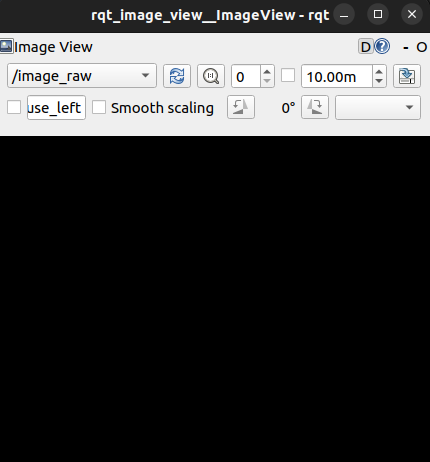

# test 05

## test description:

* 安装usb_cam驱动笔记本电脑自带的摄像头
  
* 新建功能包，编写节点实时订阅摄像头发布的图像话题消息并将ROS图像消息转换为OpenCV图像
  
* 在图像右上角绘制矩形，再将OpenCV图像转换回ROS图像消息重新发布到一个新的话题
  
* 用rviz或者rqt_image_view显示图像消息
  

## usb_cam install & test

* 安装usb_cam包： `sudo apt-get install ros-humble-usb-cam`
  
* 测试:
  
  *  `ros2 run usb_cam usb_cam_node_exe` 启动摄像头
    
  * 用rviz或者rqt_image_view显示图像消息
    

## 功能包创建

* 新建workspace
  
  ```bash
  mkdir -p dev_ws/src
  ```
  
*  新建功能包
  
   ```bash
  ros2 pkg create test05_package --build-type ament_python --dependencies rclpy sensor_msgs cv_bridge image_transport py_pubsub --license Apache-2.0
  ```
  
* 编辑节点代码（Python）具体代码参考 [image_show_python_test.py](test05_ws/src/test05_package/test05_package/image_show_python_test.py) 
  
* 编辑 setup.py文件，添加程序入口
  
      ```python
      entry_points={
          'console_scripts': [
              'image_show_python_test = test05_package.image_show_python_test:main'
          ],
      },
      ```


* 在workspace 下Build package
  
  ```bash
  cd <dev_ws path>
  colcon build --packages-select test05_package
  ```
  
* 添加bash
  
  ```bash
  cd ~
  source <setup.bash的路径>/setup.bash
  ```
  

## 功能包测试

* 启动摄像头
  
  ```bash
  ros2 run usb_cam usb_cam_node_exe
  ```
  
* 启动节点
  
  ```bash
  ros2 run test05_package image_show_python_test
  ```

- 查看topic

  ```bash
  ros2 topic list
  ```

  

  可以看见topic /image_raw 和 /processed_image成功发布

* 图像显示

  ```bash
  ros2 run rqt_image_view rqt_image_view
  ```

  分别选择 /image_raw 和 /processed_image 进行显示，可以看见在后者在相应位置出现一个矩形

  

  

  